# MySQL高级

## 角色管理（MySQL8.0）

### 创建角色

```sql
create role '角色名'@'host_name'
---
CREATE ROLE 'manager'@'localhost';
```

### 给角色赋予权限

```sql
grant 权限1，权限2 ON 库名.表名 TO '角色名'@'host_name';
---
grant select update ON dbtest1.emp1 TO 'manager'@'localhost';
```

### 查看角色权限

```sql
show grants for '角色名';
show grants;
---
show grants for 'manager';
```

###回收角色的权限

```sql
revoke 权限 on 库名.表名 from '角色名'
--
revoke select update ON dbtest1.emp1 TO 'manager'@'localhost';
```

### 删除角色

```sql
drop role '角色名'
```

### 给用户赋予角色

```sql
grant '角色名' TO '用户名'
---
grant 'manager' to 'zhang3';
```

### 激活角色

```sql
select current_role();--查看用户是否激活
--
set default role all to '角色名'@'host_name';

```

### 撤销用户的角色

```sql
revoke '角色名' from '用户名'
```

## 逻辑架构

### 逻辑架构解析


### SQL执行流程

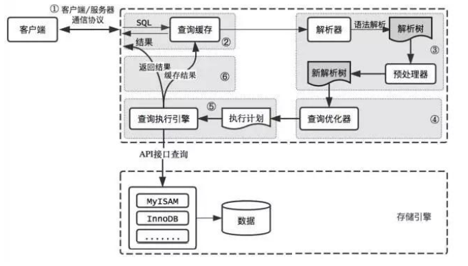

 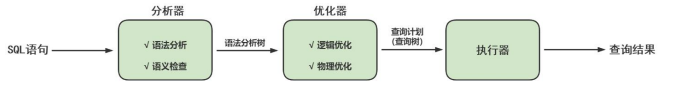

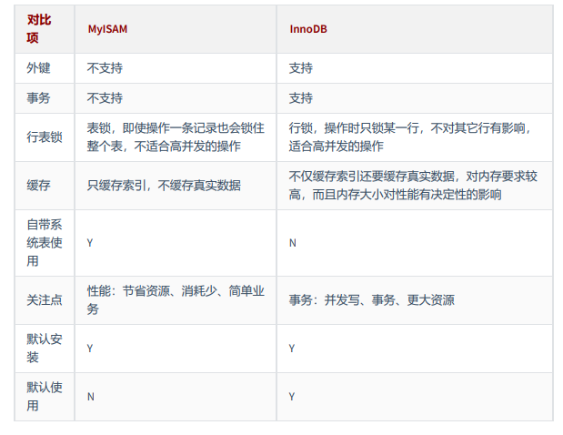

## 索引

### 索引的数据结构

#### 1.为什么使用索引

索引是一种数据结构

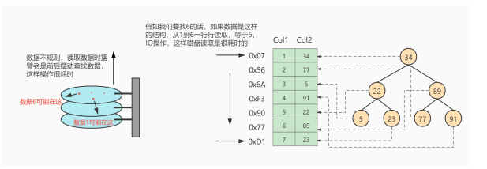

###### 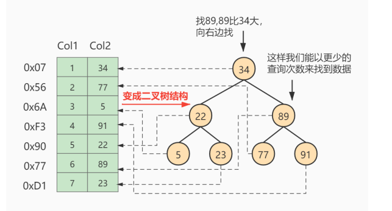

减少磁盘IO次数，加快查询速率

#### 2.索引及其优缺点

MySQL官方对索引的定义为：索引（Index）是帮助MySQL高效获取数据的数据结构

索引的本质：索引是数据结构。你可以简单理解为“排好序的快速查找数据结构”，满足特定查找算法。 这些数据结构以某种方式指向数据， 这样就可以在这些数据结构的基础上实现 高级查找算法 。

索引是在存储引擎中实现的，因此每种存储引擎的索引不一定完全相同，并且每种存储引擎不一定支持所有索引类型。同时，存储引擎可以定义每个表的最大索引数和最大索引长度。所有存储引擎支持每个表至少16个索引，总索引长度至少为256字节，有些存储引擎支持更多的索引和更大的索引长度。

##### 2.1有点

1. 类似大学图书馆建书目索引，提高数据检索的效率，降低 数据库的IO成本 ，这也是创建索引最主 要的原因.
2. 通过创建唯一索引，可以保证数据库表中每一行 数据的唯一性 。
3. 在实现数据的 参考完整性方面，可以 加速表和表之间的连接 。换句话说，对于有依赖关系的子表和父表联合查询时， 可以提高查询速度。 
4. 在使用分组和排序子句进行数据查询时，可以显著减少查询中分组和排序的时 间 ，降低了CPU的消耗。

##### 2.2缺点

1. 创建索引和维护索引要 耗费时间 ，并 且随着数据量的增加，所耗费的时间也会增加
2. 索引需要占 磁盘空间 ，除了数据表占数据空间之 外，每一个索引还要占一定的物理空间， 存储在磁盘上 ，如果有大量的索引，索引文件就可能比数据文 件更快达到最大文件尺寸。 
3. 虽然索引大大提高了查询速度，同时却会 降低更新表的速度 。当对表 中的数据进行增加、删除和修改的时候，索引也要动态地维护，这样就降低了数据的维护速度。

##### 2.3常见的索引

索引按照物理实现方式，索引可以分为 2 种：聚簇（聚集）和非聚簇（非聚集）索引。我们也把非聚集 索引称为二级索引或者辅助索引。

1. 聚簇(聚集)索引:有称为主键索引
2. 非聚集索引称为二级索引或者辅助索引

###### 聚簇索引:

并不是一种单独的索引类型，而是一种数据存储方式(所有的用户记录都存储在了叶子节点)，也就是所谓的索引即数据，数据即索引

1. 特点：

   1. 使用记录主键值的大小进行记录和页的排序，这包括三个方面的含义：

      * ：页内 的记录是按照主键的大小顺序排成一个 单向链表 。

      * ：各个存放 用户记录的页 也是根据页中用户记录的主键大小顺序排成一个 双向链表 。

      * ：存放 目录项记录的页 分为不同的层次，在同一层次中的页也是根据页中目录项记录的主键 大小顺序排成一个 双向链表 。

   2. B+树的 叶子节点 存储的是完整的用户记录。

      所谓完整的用户记录，就是指这个记录中存储了所有列的值（包括隐藏列）。 

2. 优点:

   * 数据访问更快 ，因为聚簇索引将索引和数据保存在同一个B+树中，因此从聚簇索引中获取数据比非 聚簇索引更快
   * 聚簇索引对于主键的 排序查找 和 范围查找 速度非常快 
   * 按照聚簇索引排列顺序，查询显示一定范围数据的时候，由于数据都是紧密相连，数据库不用从多 个数据块中提取数据，所以 节省了大量的io操作 。

3. 缺点

   * 插入速度严重依赖于插入顺序 ，按照主键的顺序插入是最快的方式，否则将会出现页分裂，严重影 响性能。因此，对于InnoDB表，我们一般都会定义一个自增的ID列为主键 
   * 更新主键的代价很高 ，因为将会导致被更新的行移动。因此，对于InnoDB表，我们一般定义主键为 不可更新 
   * 二级索引访问需要两次索引查找 ，第一次找到主键值，第二次根据主键值找到行数据

4. 限制：

   * 对于MySQL数据库目前只有InnoDB数据引擎支持聚簇索引，而MyISAM并不支持聚簇索引
   * 由于数据物理存储排序方式只能有一种，所有以每个MySQL的表只能有一个聚簇索引。一般情况下就是该表的逐渐。
   * 如果没有定义逐渐，InnoDB会选择非空的唯一索引代替。如果没有这样的索引，InnoDB会隐式的定义一个主键来作为聚簇索引。
   * 为了充分利用聚簇索引的聚簇的特性，所以InnoDB表的主键列经量选用有序的顺序id，而不建议用无序id，比如UUID，MD5，HASH，字符串作为主键无法保证数据的顺序增长。

###### 二级索引（辅助索引、非聚簇索引）

回表：我们根据这个以c2列大小排序的B+树只能确定我们要查找记录的主键值，所以如果我们想根 据c2列的值查找到完整的用户记录的话，仍然需要到 聚簇索引 中再查一遍，这个过程称为 回表 。也就 是根据c2列的值查询一条完整的用户记录需要使用到 2 棵B+树！

 问题：为什么我们还需要一次 回表 操作呢？直接把完整的用户记录放到叶子节点不OK吗

###### 联合索引

我们也可以同时以多个列的大小作为排序规则，也就是同时为多个列建立索引，比方说我们想让B+树按 照 c2和c3列 的大小进行排序，这个包含两层含义： 

* 先把各个记录和页按照c2列进行排序。 
* 在记录的c2列相同的情况下，采用c3列进行排序 

注意一点，以c2和c3列的大小为排序规则建立的B+树称为 联合索引 ，本质上也是一个二级索引。它的意 思与分别为c2和c3列分别建立索引的表述是不同的，不同点如下：

*  建立 联合索引 只会建立如上图一样的1棵B+树。 
* 为c2和c3列分别建立索引会分别以c2和c3列的大小为排序规则建立2棵B+树

##### 2.5MyISAM 与 InnoDB对比

MyISAM的索引方式都是“非聚簇”的，与InnoDB包含1个聚簇索引是不同的。小结两种引擎中索引的区 别：

 ① 在InnoDB存储引擎中，我们只需要根据主键值对 聚簇索引 进行一次查找就能找到对应的记录，而在 MyISAM 中却需要进行一次 回表 操作，意味着MyISAM中建立的索引相当于全部都是 二级索引 。 

② InnoDB的数据文件本身就是索引文件，而MyISAM索引文件和数据文件是 分离的 ，索引文件仅保存数 据记录的地址。 

③ InnoDB的非聚簇索引data域存储相应记录 主键的值 ，而MyISAM索引记录的是 地址 。换句话说， InnoDB的所有非聚簇索引都引用主键作为data域。 

④ MyISAM的回表操作是十分 快速 的，因为是拿着地址偏移量直接到文件中取数据的，反观InnoDB是通 过获取主键之后再去聚簇索引里找记录，虽然说也不慢，但还是比不上直接用地址去访问。

 ⑤ InnoDB要求表 必须有主键 （ MyISAM可以没有 ）。如果没有显式指定，则MySQL系统会自动选择一个 可以非空且唯一标识数据记录的列作为主键。如果不存在这种列，则MySQL自动为InnoDB表生成一个隐 含字段作为主键，这个字段长度为6个字节，类型为长整型。

#### MySQL数据结构选择的合理性

1.  hash结构：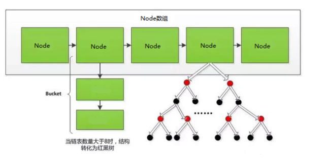


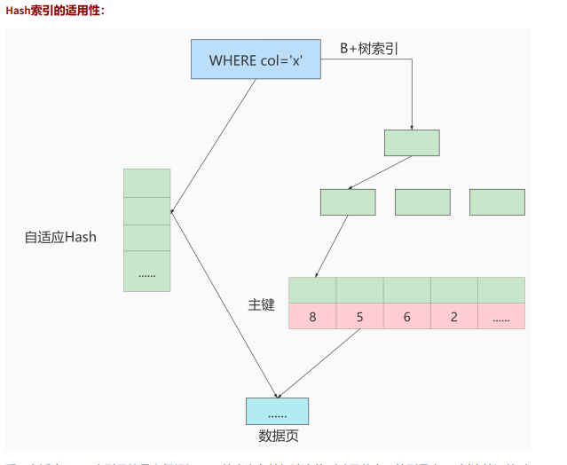

采用自适应 Hash 索引目的是方便根据 SQL 的查询条件加速定位到叶子节点，特别是当 B+ 树比较深的时 候，通过自适应 Hash 索引可以明显提高数据的检索效率。 

我们可以通过 innodb_adaptive_hash_index 变量来查看是否开启了自适应 Hash，

比如： mysql> show variables like '%adaptive_hash_index'

2.  二叉搜索树

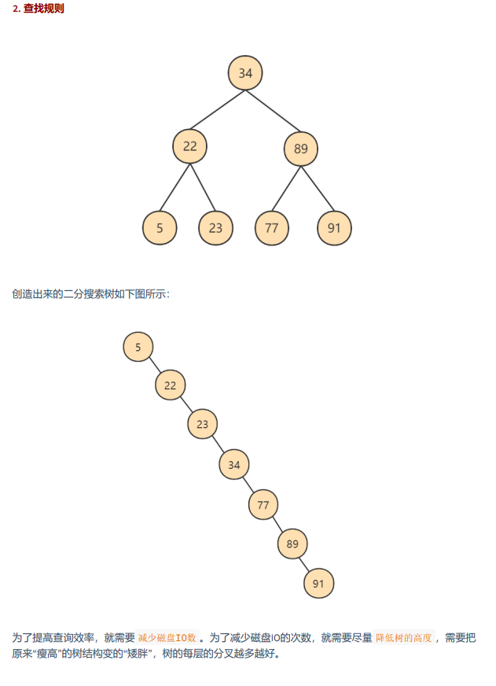

3. AVL树

   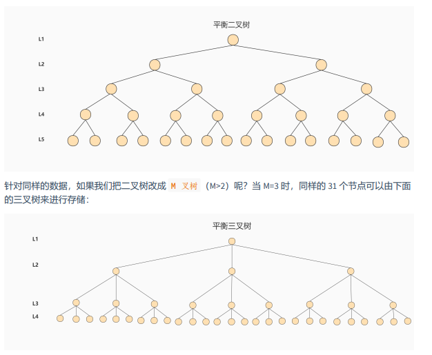

4. B-Tree

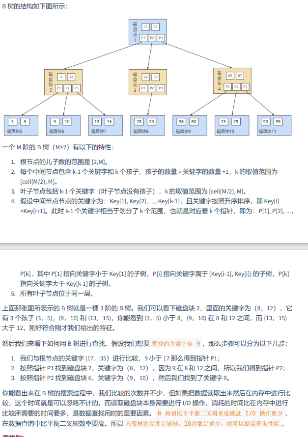

5. B+Tree

   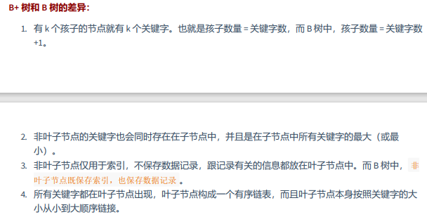

6. B-tree和B+Tree的比较

   

思考题：为了减少IO，索引树会一次性加载吗？


B+树的存储能力如何？为何说一般查找行记录，最多只需1~3次磁盘IO

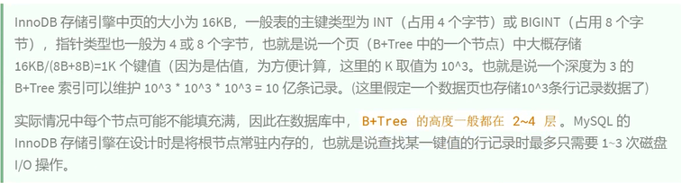

为什么说B+树比B-树更适合实际应用中操作系统的文件索引和数据库索引？ 


Hash 索引与 B+ 树索引的区别

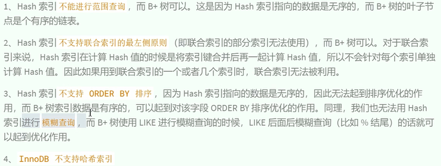

### 页的内部结构（27-32）

### 索引的创建与设计原理

#### 索引的声明与使用

##### 1.1索引的分类

MySQL的索引包括普通索引、唯一性索引、全文索引、单列索引、多列索引和空间索引等

* 从 功能逻辑 上说，索引主要有 4 种，分别是普通索引、唯一索引、主键索引、全文索引。
* 按照 物理实现方式 ，索引可以分为 2 种：聚簇索引和非聚簇索引。
* 按照 作用字段个数 进行划分，分成单列索引和联合索引。

###### 1.普通索引


###### 2.唯一索引


###### 3.主键索引


###### 4.单列索引

 

###### 5.多列(组合，联合)索引


###### 6.全文索引


###### 7.空间索引


小结：不同的存储引擎支持的索引类型也不一样 

InnoDB ：支持 B-tree、Full-text 等索引，不支持 Hash 索引； 

MyISAM ： 支持 B-tree、Full-text 等索引，不支持 Hash 索引；

 Memory ：支持 B-tree、Hash 等 索引，不支持 Full-text 索引； 

NDB ：支持 Hash 索引，不支持 B-tree、Full-text 等索引； 

Archive ：不支 持 B-tree、Hash、Full-text 等索引；

##### 1.2创建索引

 

```sql
# 01-索引的创建

#第一种：create table

# 隐式的方式创建索引。在声明有主键约束，唯一性约束，外键约束的字段上，会自动的添加相关的索引
create DATABASE dbtest2;
use dbtest2;
CREATE TABLE dept(
dept_id INT PRIMARY KEY AUTO_INCREMENT,
dept_name VARCHAR(20)
);

CREATE TABLE emp(
emp_id INT PRIMARY KEY AUTO_INCREMENT,
emp_name VARCHAR(20) UNIQUE,
dept_id INT,
CONSTRAINT emp_dept_id_fk FOREIGN KEY(dept_id) REFERENCES dept(dept_id)
);
```

创建索引的格式

```sql
CREATE TABLE table_name [col_name data_type]
[UNIQUE | FULLTEXT | SPATIAL] [INDEX | KEY] [index_name] (col_name [length]) [ASC |
DESC]
```

* UNIQUE 、 FULLTEXT 和 SPATIAL 为可选参数，分别表示唯一索引、全文索引和空间索引； 
* INDEX 与 KEY 为同义词，两者的作用相同，用来指定创建索引； 
* index_name 指定索引的名称，为可选参数，如果不指定，那么MySQL默认col_name为索引名；
*  col_name 为需要创建索引的字段列，该列必须从数据表中定义的多个列中选择；
*  length 为可选参数，表示索引的长度，只有字符串类型的字段才能指定索引长度；
* ASC 或 DESC 指定升序或者降序的索引值存储。

###### 创建普通索引

```sql
CREATE TABLE book(
book_id INT ,
book_name VARCHAR(100),
authors VARCHAR(100),
info VARCHAR(100) ,
comment VARCHAR(100),
year_publication YEAR,
#声明索引
INDEX idx_bname(book_name)
);

#查看索引
#方式一
show create table book;
#方式二
show index from book; 
```

###### 创建唯一索引

```sql
#声明有唯一索引的字段，在添加数据时，要保证唯一性，但是可以添加null
CREATE TABLE book1(
book_id INT ,
book_name VARCHAR(100),
authors VARCHAR(100),
info VARCHAR(100) ,
comment VARCHAR(100),
year_publication YEAR,
#声明索引
UNIQUE INDEX uk_idx_cmt(comment)
);
```

