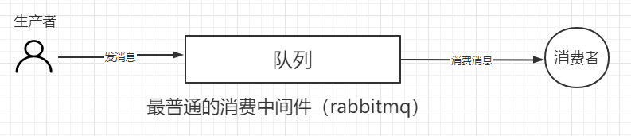
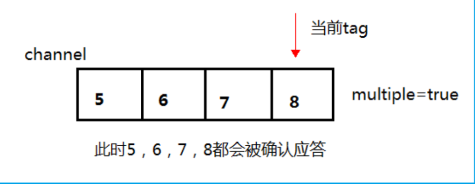
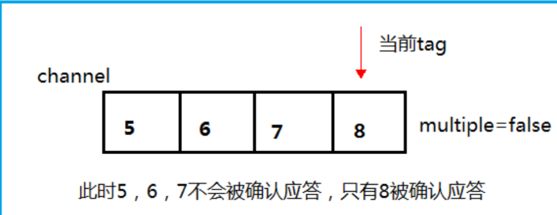
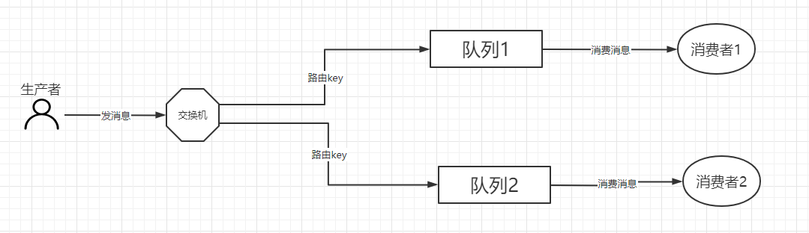
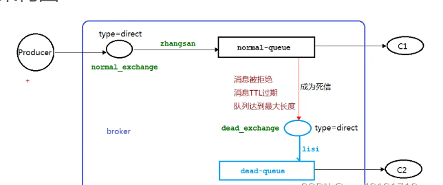
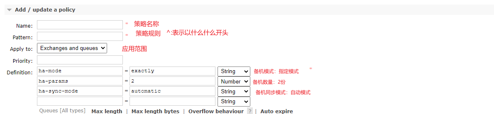

# Rabbitmq

## 简介

* Rabbitmq是一个消息中间件，负责消息的接收和转发，如同现在的快递和邮箱一样。
* 优点：
  * 解耦：rabbitmq可以使生产者和消费者解耦，生产者生产的消息可以放到rabbitmq中的队列中，即使使消费者无法消费，也不会影响到生产者。
  * 有序性：先来的先处理
  * 消息路由：可以按照不同的路由规则将消息发送到不同的队列中
  * 异步处理：
  * 流量消峰：降低流量过大对数据库的压力过大
* 缺点：
  * 系统可用性降低：如果mq挂了，有可能整套系统就崩溃了。
  * 系统复杂度提高：在整套系统中硬生生的加入MQ，对于保证没有消息重复消费的问题、对于保证消息传递顺序性问题、对于处理消息丢失的问题都比较困难
  * 一致性问题：可能存在A系统处理完请求直接返回成功，但是在BCD三个系统那里，BD 两个系统写库成功了，结果C系统写库失败了，造成数据不一致问题。

## rabbitmq中的四大组件

### 生产者(Producer)

* 生成者就是发送消息的程序。

### 交换机(Exchange)

* 接收生产者生产的消息，根据不同发规则发送给不同的队列。
* 信道：生产者和消费者这间进行通信需要信道连接
* 路由key：信道和队列进行绑定需要路由key

### 队列(Queue)

* 存储消息的一个缓存区。

### 消费者(Consumer)

* 消费生产者生产出来的消息

## 简单模式(使用默认交换机)

* 在一般情况下(没有设置不公平分发和预取值)是轮询分发机制，多个消费者之间是轮替消费。



### 需要的依赖

```xml
<dependency>
    <groupId>com.rabbitmq</groupId>
    <artifactId>amqp-client</artifactId>
    <version>5.14.2</version>
</dependency>
```

### 生产者代码

```java
package com.gyf.rabbitmq.one;

import com.rabbitmq.client.Channel;
import com.rabbitmq.client.Connection;
import com.rabbitmq.client.ConnectionFactory;

/**
 * @author 龚燕飞
 */
public class Producer {

    /**
     * 队列名称
     */
    private static final String QUEUE_NAME="hello";

    public static void main(String[] args) throws Exception {

        /**
         * 创建一个连接工厂，连接到服务器上的rabbitmq
         */
        ConnectionFactory factory = new ConnectionFactory();
        //连接地址
        factory.setHost("182.92.130.214");
        //登录名称
        factory.setUsername("admin");
        //登录密码
        factory.setPassword("Sxy990510+");
        //创建一个连接
        Connection connection = factory.newConnection();
        //根据连接创建一个信道，使用信道进行发送消息
        Channel channel = connection.createChannel();
        /**
         * queue – 队列的名称
         * durable(持久) - 如果我们声明一个持久队列，则为真（该队列将在服务器重新启动后继续存在）:是否将队列保存到磁盘上
         * exclusive(独占) - 如果我们声明一个独占队列，则为真（仅限于此连接）：是否和其他队列共享
         * autoDelete – 如果我们声明一个自动删除队列，则为 true（服务器将在不再使用时将其删除）：是否自动删除
         * arguments – 队列的其他属性（构造参数）
         */
        //使用信道创建一个队列
        channel.queueDeclare(QUEUE_NAME,false,false,false,null);
        //消息内容
        String message = "hello rabbitmq";
        /**
         * exchange(交换器) - 将消息发布到的交换器
         * routingKey – 路由键
         * props - 消息的其他属性 - 路由标头等
         * body(正文) - 消息正文：消息正文需要转换为字节类型
         */
        /**
         * 发送消息
         * 使用rabbitmq中自带的交换机，所有交换机为空
         */
        channel.basicPublish("",QUEUE_NAME,null,message.getBytes());
        System.out.println("消息发送完毕");
    }

}

```

### 消费者代码

```java
package com.gyf.rabbitmq.one;

import com.rabbitmq.client.*;

/**
 * @author 龚燕飞
 */
public class Consumer {
    private static final String QUEUE_NAME="hello";


    public static void main(String[] args) throws Exception {
        /**
         * 创建一个连接工厂，连接到服务器上的rabbitmq
         */
        ConnectionFactory factory = new ConnectionFactory();
        //连接地址
        factory.setHost("182.92.130.214");
        //登录名称
        factory.setUsername("admin");
        //登录密码
        factory.setPassword("Sxy990510+");
        //创建一个连接
        Connection connection = factory.newConnection();
        //根据连接创建一个信道，使用信道进行发送消息
        Channel channel = connection.createChannel();

        /**
         * 消息消费成功时的回调接口，这是一个方法接口，可以直接使用Lambda表达式
         * consumerTag – 与消费者关联的消费者标签
         * message – 传递的消息
         */
        DeliverCallback deliverCallback =(consumerTag, message)->{
            System.out.println(new String(message.getBody()));
        };
        /**
         * 消息消费失败时的回调接口，这是一个方法接口，可以直接使用Lambda表达式
         * consumerTag – 与消费者关联的消费者标签
         */
        CancelCallback cancelCallback = consumerTag->{
            System.out.println("消息被中断");
        };
        /**
         * queue – 队列的名称
         * autoAck – 如果服务器应考虑消息在传递后确认，则为 true；如果服务器应该期待明确的确认，则为 false；是否自动确认消息
         * deliverCallback – 消息传递时的回调；消息消费成功时触发该回调执行回调函数中的代码
         * cancelCallback – 消费者取消时的回调；消息消费失败时触发该回调执行回调函数中的代码
         */
        channel.basicConsume(QUEUE_NAME,true,deliverCallback,cancelCallback);

    }
}

```

### 消息持久化

* 将消息保存到磁盘中

  ```java
  package com.gyf.rabbitmq.one;
  
  import com.rabbitmq.client.Channel;
  import com.rabbitmq.client.Connection;
  import com.rabbitmq.client.ConnectionFactory;
  
  /**
   * @author 龚燕飞
   */
  public class Producer {
  
      /**
       * 队列名称
       */
      private static final String QUEUE_NAME="hello";
  
      public static void main(String[] args) throws Exception {
          Channel channel = connection.createChannel();
          channel.queueDeclare(QUEUE_NAME,false,false,false,null);
          String message = "hello rabbitmq";
          //将消息保存到磁盘中
          AMQP.BasicProperties persistentTextPlain = MessageProperties.PERSISTENT_TEXT_PLAIN;
          channel.basicPublish("",QUEUE_NAME,persistentTextPlain,message.getBytes());
          System.out.println("消息发送完毕");
      }
  
  }
  
  ```


### 消息手动应答

* 一般在项目中我们不适用自动确认，而是使用手动确认消息，消息手动确认需要在消费者端开启；需要将`basicConsume`中的`autoAck`设置为`false`,在`deliverCallback`中添加`channel`的`basicAck`属性，来开启手动确认消息

* multiple：

  * 
  * 

  代码

  ```java
  package com.gyf.rabbitmq.three;
  
  import com.gyf.rabbitmq.utils.RabbitmqUtils;
  import com.rabbitmq.client.Channel;
  import com.rabbitmq.client.DeliverCallback;
  
  /**
   * @author 龚燕飞
   *
   */
  //消费者
  public class Work02 {
      public static final String ASK_QUEUE = "ask_queue_name";
  
      public static void main(String[] args) throws  Exception  {
          Channel channel = RabbitmqUtils.getChannel();
          System.out.println("Work02正在等待时间较短...");
          DeliverCallback deliverCallback = (consumerTag, message) ->{
                  System.out.println("接收到的消息为："+new String(message.getBody(),"UTF-8"));
                  /**
                   * deliveryTag – 收到的AMQP.Basic.GetOk或AMQP.Basic.Deliver的标签
                   * multiple – true 以确认所有消息，包括提供的交付标签； false 仅确认提供的交付标签;是否把所有的消息全部确认，一般是false
                   */
                  channel.basicAck(message.getEnvelope().getDeliveryTag(),false);
          };
          boolean autoAsk = false;
          channel.basicConsume(ASK_QUEUE,autoAsk,deliverCallback,(key)->{
              System.out.println("消息中断");
          });
      }
  }
  ```

### 设置不公平分发和预取值

* 在生产环境中，消费者服务器的之间的性能高低不一，处理任务的能力就不尽相同。如果消费者A消费消息能力快，而消费者B消费消息能力慢，如果时候原始的轮询机制，消费者A将会有很长一段时候处于闲置状态，这是不希望看到的，所以在这种情况下我们需要开启不公平分发(能者多劳)，在消费者A已完成消费，消费者B在进行消费的时候，有又消息发送到消费者B，这是消费者B没有完成消费，则消息会找空闲的消费者A进行消费

  * 不公平分发设置：在消费者端使用`channel`的属性`basicQos(prefetchCount)`属性。其中`prefetchCount=1`

* 预取值：在设置预取值后，在生产者生产消息到消费者时，会在队列到消费者之间的信道中设置预取值大小的空间，将消息先存储到设置的空间中，当空间存储已满时，需要消费完其中的一个消息，才能进入另一个消息。

  * 预取值的设置和不公平分发设置一样，只是`basicQos(prefetchCount)`中的值不一样,当`prefetchCount=1`时则是不公平分发，当`prefetchCount=5`则是预取值的空间大小为5，这个值可以自行设置。

  代码

  ```java
  package com.gyf.rabbitmq.three;
  
  import com.gyf.rabbitmq.utils.RabbitmqUtils;
  import com.rabbitmq.client.Channel;
  import com.rabbitmq.client.DeliverCallback;
  
  /**
   * @author 龚燕飞
   *
   */
  public class Work03 {
      public static final String ASK_QUEUE = "ask_queue_name";
  
      public static void main(String[] args) throws  Exception  {
          Channel channel = RabbitmqUtils.getChannel();
          System.out.println("Work02正在等待时间较短...");
  
  
          DeliverCallback deliverCallback = (consumerTag, message) ->{
                  System.out.println("接收到的消息为："+new String(message.getBody(),"UTF-8"));
          };
          boolean autoAsk = false;
          /**
           * 设置不公平分发，当prefetchCount值为1时才为不公平分发：int prefetchCount = 1;
           * 当prefetchCount值大于1时则为预取值：int prefetchCount = 2;
           */
          int prefetchCount = 2;
          channel.basicQos(prefetchCount);
          channel.basicConsume(ASK_QUEUE,autoAsk,deliverCallback,(key)->{
              System.out.println("消息中断");
          });
      }
  }
  
  ```

### 消息确认

* 当生产者发送消息时，我们不知道我们发送的消息是否发送成功，所有我们需要进行消息是否发送成功的确认。

  * 在消费者端开启`channel`的`confirmSelect()`属性。消息确认有三种类型，单独消息确认，批量消息确认，异步消息确认

    代码

    ```java
    package com.gyf.rabbitmq.four;
    
    import com.gyf.rabbitmq.utils.RabbitmqUtils;
    import com.rabbitmq.client.Channel;
    import com.rabbitmq.client.ConfirmCallback;
    
    import java.util.UUID;
    import java.util.concurrent.ConcurrentNavigableMap;
    import java.util.concurrent.ConcurrentSkipListMap;
    
    /**
     * @author 龚燕飞
     */
    public class ConfirmMessage {
        public static final int QUEUE_COUNT=100;
    
        public static void main(String[] args) throws Exception {
    
            publishMessageIndividually();
           // publishMessageBatch();
    //        publishMessageAsync();
        }
    
    
        /**
         * 单独消息确认
         * @throws Exception
         */
        public static void publishMessageIndividually() throws Exception{
            Channel channel = RabbitmqUtils.getChannel();
            String queue_name = UUID.randomUUID().toString();
            channel.queueDeclare(queue_name,false,false,false,null);
            //开启消息确认
            channel.confirmSelect();
            long begin = System.currentTimeMillis();
            //单独消息确认
            for (int i = 0; i < QUEUE_COUNT; i++) {
                String queue_message = i+"";
                channel.basicPublish("",queue_name,null,queue_message.getBytes());
                //等待上一个消息是否发送成功的确认消息
                boolean flag = channel.waitForConfirms();
                if (flag) {
                    System.out.println("消息发送成功");
                }
            }
            long end = System.currentTimeMillis();
            System.out.println("消耗时间为"+(end-begin));
        }
    
        /**
         * 批量消息确认
         * @throws Exception
         */
        public static void publishMessageBatch() throws Exception{
            Channel channel = RabbitmqUtils.getChannel();
            String queue_name = UUID.randomUUID().toString();
            channel.queueDeclare(queue_name,false,false,false,null);
            //开启消息确认
            channel.confirmSelect();
            //批量确认操作
            int batchSize = 10;
    
            long begin = System.currentTimeMillis();
            for (int i = 0; i < QUEUE_COUNT; i++) {
                String queue_message = i+"";
                channel.basicPublish("",queue_name,null,queue_message.getBytes());
                if(i%batchSize==0){
                    channel.waitForConfirms();
                }
            }
            long end = System.currentTimeMillis();
            System.out.println("消耗时间为"+(end-begin));
        }
    
        /**
         * 异步消息确认
         * @throws Exception
         */
        public static void publishMessageAsync() throws Exception{
            Channel channel = RabbitmqUtils.getChannel();
            String queue_name = UUID.randomUUID().toString();
            channel.queueDeclare(queue_name,false,false,false,null);
            //开启消息确认
            channel.confirmSelect();
    
            ConcurrentSkipListMap<Long,String> map = new ConcurrentSkipListMap<>();
    
            //异步确认操作
            //确认回调，消息发送成功回调
            /**
             * deliveryTag：消息标签
             * multiple：是否批量确认
             */
            ConfirmCallback ackCallback=(deliveryTag, multiple)->{
                if(multiple){
                    ConcurrentNavigableMap<Long, String> longStringConcurrentNavigableMap = map.headMap(deliveryTag);
                    longStringConcurrentNavigableMap.clear();
                }else {
                    map.remove(deliveryTag);
                }
                System.out.println(deliveryTag+"成功");
            };
            //失败回调，消息发送失败回调
            ConfirmCallback nackCallback=(deliveryTag, multiple)->{
                String nackMessage = map.get(deliveryTag);
                System.out.println(nackMessage+"的消息未确认"+deliveryTag+"失败");
            };
    
            //监听确认回调和未确认回调
            channel.addConfirmListener(ackCallback,nackCallback);
            long begin = System.currentTimeMillis();
            for (int i = 0; i < QUEUE_COUNT; i++) {
                String queue_message = i+"";
                channel.basicPublish("",queue_name,null,queue_message.getBytes());
                //channel.getNextPublishSeqNo()：获取下一个发布序列号
                map.put(channel.getNextPublishSeqNo(),queue_message);
            }
            long end = System.currentTimeMillis();
            System.out.println("消耗时间为"+(end-begin));
        }
    
    }
    ```

## 普通模式(有交换机)



* 生产者生产消息发送给交换机，交换机根据模式进行消息的分发。

### 扇出模式(fanout)

* 介绍：再这个模式下的交换机和队列绑定之间没有路由key，生产者生产消息，发送给交换机，交换机将消息发送给绑定再这个交换机上面所有的队列。

* 生产者代码

  ```java
  import com.gyf.rabbitmq.utils.RabbitmqUtils;
  import com.rabbitmq.client.AMQP;
  import com.rabbitmq.client.BuiltinExchangeType;
  import com.rabbitmq.client.Channel;
  import com.rabbitmq.client.MessageProperties;
  import com.sun.org.apache.xpath.internal.objects.XStringForFSB;
  
  import java.util.Scanner;
  
  /**
   * @author 龚燕飞
   */
  public class SendLog {
  
      //交换机名称
      public static final String EXCHANGE_NAME = "logs";
      public static void main(String[] args) throws Exception {
          Channel channel = RabbitmqUtils.getChannel();
          /**
           * exchange(交换机)——交换机的名称
           * type – 交换机类型
           *        direct - 直连类型
           *        fanout - 扇形类型
           *        topic - 主题类型
           */
          //声明交换机
          channel.exchangeDeclare(EXCHANGE_NAME, BuiltinExchangeType.FANOUT);
  
          Scanner scanner = new Scanner(System.in);
          while (scanner.hasNext()){
              String message= scanner.next();
              //发送消息，将消息发送给交换机，由于是扇出模式，不需要路由key，所以路由key为空
              channel.basicPublish(EXCHANGE_NAME,"" ,null,message.getBytes("UTF-8"));
              System.out.println("发送消息完成："+message);
          }
      }
  
  }
  ```

* 消费者代码

  ```java
  //消费者一
  import com.gyf.rabbitmq.utils.RabbitmqUtils;
  import com.rabbitmq.client.Channel;
  import com.rabbitmq.client.DeliverCallback;
  import com.rabbitmq.client.Delivery;
  
  /**
   * @author 龚燕飞
   */
  public class ReceiveLog01 {
  
      public static final String EXCHANGE_NAME = "logs";
      public static final String QUEUE_NAME1 = "logs_queue_1";
  
      public static void main(String[] args) throws Exception {
          Channel channel = RabbitmqUtils.getChannel();
          channel.queueDeclare(QUEUE_NAME1,false,false,false,null);
          /**
           * @param queue 队列名称
           * @param exchange 交换机名称
           * @param routingKey 交换机和队列绑定的路由key
           */
          channel.queueBind(QUEUE_NAME1,EXCHANGE_NAME,"");
          DeliverCallback deliverCallback = ( consumerTag,  message)->{
              System.out.println("ReceiveLog01接收到的消息是："+new String(message.getBody(),"UTF-8"));
          };
          channel.basicConsume(QUEUE_NAME1,true,deliverCallback,consumerTag -> {});
      }
  }
  
  //消费者二
  import com.gyf.rabbitmq.utils.RabbitmqUtils;
  import com.rabbitmq.client.Channel;
  import com.rabbitmq.client.DeliverCallback;
  
  /**
   * @author 龚燕飞
   */
  public class ReceiveLog02 {
  
      public static final String EXCHANGE_NAME = "logs";
      public static final String QUEUE_NAME2 = "logs_queue_2";
  
      public static void main(String[] args) throws Exception {
          Channel channel = RabbitmqUtils.getChannel();
          channel.queueDeclare(QUEUE_NAME2,false,false,false,null);
          channel.queueBind(QUEUE_NAME2,EXCHANGE_NAME,"");
  
          DeliverCallback deliverCallback = ( consumerTag,  message)->{
              System.out.println("ReceiveLog02接收到的消息是："+new String(message.getBody(),"UTF-8"));
          };
          channel.basicConsume(QUEUE_NAME2,true,deliverCallback,consumerTag -> {});
      }
  }
  ```

### 直连模式(direct)

* 介绍：再这个模式下的交换机和队列绑定之间需要有固定的路由key，生产者生产消息，发送给交换机，交换机根据路由key将消息发送给对应的队列。

* 生产者代码

  ```java
  import com.gyf.rabbitmq.utils.RabbitmqUtils;
  import com.rabbitmq.client.BuiltinExchangeType;
  import com.rabbitmq.client.Channel;
  
  import java.util.Scanner;
  
  /**
   * @author 龚燕飞
   */
  public class SendLogsDirectly {
      public static final String EXCHANGE_NAME = "direct_logs";
  
      public static void main(String[] args) throws Exception {
          Channel channel = RabbitmqUtils.getChannel();
          //声明交换机为直连模式
          channel.exchangeDeclare(EXCHANGE_NAME, BuiltinExchangeType.DIRECT);
  
          Scanner scanner = new Scanner(System.in);
          while (scanner.hasNext()){
              String message= scanner.next();
              //将消息发送到交换机上，路由key为002
              channel.basicPublish(EXCHANGE_NAME,"002" ,null,message.getBytes("UTF-8"));
              System.out.println("发送消息完成："+message);
          }
      }
  }
  ```

* 消费者代码

  ```java
  //消费者一
  import com.gyf.rabbitmq.utils.RabbitmqUtils;
  import com.rabbitmq.client.Channel;
  import com.rabbitmq.client.DeliverCallback;
  import com.rabbitmq.client.Delivery;
  
  /**
   * @author 龚燕飞
   */
  public class ReceiveLogsDirectly01 {
  
      public static final String EXCHANGE_NAME = "direct_logs";
  
      public static void main(String[] args) throws Exception {
  
          Channel channel = RabbitmqUtils.getChannel();
          channel.queueDeclare("console",false,false,false,null);
          //一个队列可以绑定多个路由key
          channel.queueBind("console",EXCHANGE_NAME,"001");
          channel.queueBind("console",EXCHANGE_NAME,"002");
          channel.basicConsume("console",true, (consumerTag, message)->{
              System.out.println("ReceiveLogsDirectly01接收到的消息为"+ new String(message.getBody(),"UTF-8"));
          },consumerTag -> {});
      }
  }
  
  
  //消费者二
  import com.gyf.rabbitmq.utils.RabbitmqUtils;
  import com.rabbitmq.client.BuiltinExchangeType;
  import com.rabbitmq.client.Channel;
  
  /**
   * @author 龚燕飞
   */
  public class ReceiveLogsDirectly02 {
  
      public static final String EXCHANGE_NAME = "direct_logs";
  
      public static void main(String[] args) throws Exception {
  
          Channel channel = RabbitmqUtils.getChannel();
          channel.queueDeclare("disk",false,false,false,null);
          channel.queueBind("disk",EXCHANGE_NAME,"003");
          channel.basicConsume("disk",true, (consumerTag, message)->{
              System.out.println("ReceiveLogsDirectly02接收到的消息为"+ new String(message.getBody(),"UTF-8"));
          },consumerTag -> {});
      }
  }
  ```

### 主题模式(topic)

* 介绍：再这个模式下的交换机和队列是根据一种规则的路由key进行绑定，生产者生产消息，发送给交换机，交换机根据这样规则路由key将消息发送给不同的队列。

* 规则模式：*代表一个单词，#可以代替零个或多个单词，单词最多 255 个字节，通过相关的匹配规则后就会将满足条件的消息放到对应的[队列](https://so.csdn.net/so/search?q=队列&spm=1001.2101.3001.7020)中，每个单词之间要用点隔开。

  * 例如：*.row.# ：则(ww.row;ss.row;sd.row.hdh)等绑定路由key的队列都能接收到消息。

* 生产者代码

  ```JAVA
  import com.gyf.rabbitmq.utils.RabbitmqUtils;
  import com.rabbitmq.client.AMQP;
  import com.rabbitmq.client.BuiltinExchangeType;
  import com.rabbitmq.client.Channel;
  
  import java.util.Scanner;
  
  /**
   * @author 龚燕飞
   */
  public class SendLogsTopic {
      public static final String EXCHANGE_NAME = "topic_logs";
  
      public static void main(String[] args) throws Exception {
          Channel channel = RabbitmqUtils.getChannel();
  
          //声明交换机，模式为主题模式
          channel.exchangeDeclare(EXCHANGE_NAME, BuiltinExchangeType.TOPIC);
          Scanner scanner = new Scanner(System.in);
          while (scanner.hasNext()){
              String message= scanner.next();
              //发送消息到交换机，路由key为：11.Qq.QQ
              channel.basicPublish(EXCHANGE_NAME,"11.Qq.QQ" ,null,message.getBytes("UTF-8"));
              System.out.println("发送消息完成："+message);
          }
      }
  }
  ```

* 消费者代码

  ```java
  //消费者一
  import com.gyf.rabbitmq.utils.RabbitmqUtils;
  import com.rabbitmq.client.BuiltinExchangeType;
  import com.rabbitmq.client.Channel;
  
  /**
   * @author 龚燕飞
   */
  public class ReceiveLogTopics01 {
      public static final String EXCHANGE_NAME = "topic_logs";
  
      public static void main(String[] args) throws Exception {
  
          Channel channel = RabbitmqUtils.getChannel();
          channel.queueDeclare("Q1",false,false,false,null);
          //队列和交换机进行绑定，绑定的路由key规则
          //路由key规则是：三个单词，第一个和第三个单词任意，第二个单词必须为Q1
          channel.queueBind("Q1",EXCHANGE_NAME,"*.Q1.*");
          //路由key规则是：三个单词，第一个和第二个单词任意，第三个单词必须为QQ
          channel.queueBind("Q1",EXCHANGE_NAME,"*.*.QQ");
          channel.basicConsume("Q1",true, (consumerTag, message)->{
              System.out.println("ReceiveLogTopics01接收到的消息为"+ new String(message.getBody(),"UTF-8"));
          },consumerTag -> {});
      }
  }
  
  
  //消费者二
  import com.gyf.rabbitmq.utils.RabbitmqUtils;
  import com.rabbitmq.client.BuiltinExchangeType;
  import com.rabbitmq.client.Channel;
  
  /**
   * @author 龚燕飞
   */
  public class ReceiveLogTopics02 {
      public static final String EXCHANGE_NAME = "topic_logs";
  
      public static void main(String[] args) throws Exception {
  
          Channel channel = RabbitmqUtils.getChannel();
          channel.queueDeclare("Q2",false,false,false,null);
          //路由key规则是：至少为两个单词，第一个任意，第二个单词必须为Q1,后面有零个或无数个单词都可以
          channel.queueBind("Q2",EXCHANGE_NAME,"*.Q1.#");
          channel.basicConsume("Q2",true, (consumerTag, message)->{
              System.out.println("ReceiveLogTopics02接收到的消息为"+ new String(message.getBody(),"UTF-8"));
          },consumerTag -> {});
      }
  }
  ```

## 死信队列

* **介绍**：死信，顾名思义就是无法被消费的信息。一般来说，producer将消息投递到broker或者直接到queue里，consumer从queue取出消息进行消费，但某些时候由于特定的原因导致queue中的某些消息无法被消费，这样的消息如果没有后续的处理，就变成了死信(Dead Letter)，所有的死信都会放到死信队列中。
  *  应用场景：为了保证订单业务的消息数据不丢失，需要使用到RabbitMq的死信队列机制，当消息消费发生异常时，将消息投入死信队列中。还有比如说：用户在商城下单成功并点击支付后在指定时间未支付时自动失效（可以用来做延迟消息）
  * 

* **消息变成死信有以下几种情况**

### 消息 TTL 过期

* 消息 TTL 过期（TTL：存活时间，规定时间没被消费到）

  生产者代码

  ```java
  import com.gyf.rabbitmq.utils.RabbitmqUtils;
  import com.rabbitmq.client.AMQP;
  import com.rabbitmq.client.Channel;
  
  /**
   * @author 龚燕飞
   */
  public class DeadLetterTask {
      public static final String COMMON_EXCHANGE = "common_exchange";
  
  
      public static void main(String[] args) throws Exception {
          Channel channel = RabbitmqUtils.getChannel();
          
           /**设置消息过期时间，如果10秒消息未被消费则变成死信
           * expiration：到期时间，单位毫秒
           */
          AMQP.BasicProperties properties = new AMQP.BasicProperties().builder().expiration("10000").build();
  
          for (int i = 0; i < 10; i++) {
              String message = "info"+i;
              //发送10条消息给正常交换机
              channel.basicPublish(COMMON_EXCHANGE,"wangwu",properties,message.getBytes());
          }
      }
  }
  ```

  正常队列和消费者代码

  ```java
  import com.gyf.rabbitmq.utils.RabbitmqUtils;
  import com.rabbitmq.client.BuiltinExchangeType;
  import com.rabbitmq.client.Channel;
  
  import java.util.HashMap;
  import java.util.Map;
  
  /**
   * @author 龚燕飞
   */
  public class DeadLetterTest01 {
  
      /**
       * 死信路由
       */
      public static final String DEAD_EXCHANGE = "dead_exchange";
      /**普通路由*/
      public static final String COMMON_EXCHANGE = "common_exchange";
      /**死信队列*/
      public static final String DEAD_QUEUE = "dead_queue";
      /**普通队列*/
      public static final String COMMON_QUEUE = "common_queue";
  
  
      public static void main(String[] args) throws Exception {
  
          Channel channel = RabbitmqUtils.getChannel();
          //声明正常交换机和死信交换机
          channel.exchangeDeclare(DEAD_EXCHANGE, BuiltinExchangeType.DIRECT);
          channel.exchangeDeclare(COMMON_EXCHANGE,BuiltinExchangeType.DIRECT);
  
          Map<String,Object> map = new HashMap<>();
          //设置死信交换机和死信路由key
          map.put("x-dead-letter-exchange",DEAD_EXCHANGE);
          map.put("x-dead-letter-routing-key","lisi");
          
          /**
           * 声明正常队列和死信队列
           * 将死信交换机和路由key的信息以属性配置到正常队列中，当消息变成死信时，可以找到死信消息转发到那个交换机中
           */
          channel.queueDeclare(COMMON_QUEUE,false,false,false,map);
          //死信队列不需要进行其他操作，正常声明
          channel.queueDeclare(DEAD_QUEUE,false,false,false,null);
          //正常交换机和正常队列绑定
          channel.queueBind(COMMON_QUEUE,COMMON_EXCHANGE,"wangwu");
          //死信交换机和死信队列绑定
          channel.queueBind(DEAD_QUEUE,DEAD_EXCHANGE,"lisi");
  
          //接收正常队列的消息
          channel.basicConsume(COMMON_QUEUE,false,(key,message)->{
                  System.out.println("接收到的消息为："+ new String(message.getBody(),"UTF-8"));
          },consumerTag -> {});
      }
  }
  ```

  死信队列和消费者代码

  ```java
  import com.gyf.rabbitmq.utils.RabbitmqUtils;
  import com.rabbitmq.client.BuiltinExchangeType;
  import com.rabbitmq.client.Channel;
  
  import java.util.HashMap;
  import java.util.Map;
  
  /**
   * @author 龚燕飞
   */
  public class DeadLetterTest02 {
  
      /**
       * 死信路由
       */
      public static final String DEAD_EXCHANGE = "dead_exchange";
      /**死信队列*/
      public static final String DEAD_QUEUE = "dead_queue";
  
  
      public static void main(String[] args) throws Exception {
  
          Channel channel = RabbitmqUtils.getChannel();
          channel.exchangeDeclare(DEAD_EXCHANGE, BuiltinExchangeType.DIRECT);
  
          channel.queueDeclare(DEAD_QUEUE,false,false,false,null);
          channel.queueBind(DEAD_QUEUE,DEAD_EXCHANGE,"lisi");
  
          channel.basicConsume(DEAD_QUEUE,true,(key,message)->{
              System.out.println("DeadLetterTest02接收到的消息为："+new String(message.getBody(),"UTF-8"));
          },consumerTag -> {});
      }
  }
  ```

### 队列达到最大长度

- 队列达到最大长度(队列满了，无法再添加数据到 mq 中)。

  生产者代码

  ```java
  import com.gyf.rabbitmq.utils.RabbitmqUtils;
  import com.rabbitmq.client.AMQP;
  import com.rabbitmq.client.Channel;
  
  /**
   * @author 龚燕飞
   */
  public class DeadLetterTask {
      public static final String COMMON_EXCHANGE = "common_exchange";
  
  
      public static void main(String[] args) throws Exception {
          Channel channel = RabbitmqUtils.getChannel();
  
          for (int i = 0; i < 10; i++) {
              String message = "info"+i;
              //发送10条消息给正常交换机
              channel.basicPublish(COMMON_EXCHANGE,"wangwu",null,message.getBytes());
          }
      }
  }
  ```

  正常队列和消费者代码

  ```java
  import com.gyf.rabbitmq.utils.RabbitmqUtils;
  import com.rabbitmq.client.BuiltinExchangeType;
  import com.rabbitmq.client.Channel;
  
  import java.util.HashMap;
  import java.util.Map;
  
  /**
   * @author 龚燕飞
   */
  public class DeadLetterTest01 {
  
      /**
       * 死信路由
       */
      public static final String DEAD_EXCHANGE = "dead_exchange";
      /**普通路由*/
      public static final String COMMON_EXCHANGE = "common_exchange";
      /**死信队列*/
      public static final String DEAD_QUEUE = "dead_queue";
      /**普通队列*/
      public static final String COMMON_QUEUE = "common_queue";
  
  
      public static void main(String[] args) throws Exception {
  
          Channel channel = RabbitmqUtils.getChannel();
          //声明正常交换机和死信交换机
          channel.exchangeDeclare(DEAD_EXCHANGE, BuiltinExchangeType.DIRECT);
          channel.exchangeDeclare(COMMON_EXCHANGE,BuiltinExchangeType.DIRECT);
  
          Map<String,Object> map = new HashMap<>();
          //设置死信交换机和死信路由key
          map.put("x-dead-letter-exchange",DEAD_EXCHANGE);
          map.put("x-dead-letter-routing-key","lisi");
          //设置最大队列长度
          map.put("x-max-length",6);
          
          /**
           * 声明正常队列和死信队列
           * 将死信交换机和路由key的信息以属性配置到正常队列中，当消息变成死信时，可以找到死信消息转发到那个交换机中
           */
          channel.queueDeclare(COMMON_QUEUE,false,false,false,map);
          //死信队列不需要进行其他操作，正常声明
          channel.queueDeclare(DEAD_QUEUE,false,false,false,null);
          //正常交换机和正常队列绑定
          channel.queueBind(COMMON_QUEUE,COMMON_EXCHANGE,"wangwu");
          //死信交换机和死信队列绑定
          channel.queueBind(DEAD_QUEUE,DEAD_EXCHANGE,"lisi");
  
          //接收正常队列的消息
          channel.basicConsume(COMMON_QUEUE,false,(key,message)->{
                  System.out.println("接收到的消息为："+ new String(message.getBody(),"UTF-8"));
          },consumerTag -> {});
      }
  }
  ```

  死信队列和消费者代码

  ```java
  import com.gyf.rabbitmq.utils.RabbitmqUtils;
  import com.rabbitmq.client.BuiltinExchangeType;
  import com.rabbitmq.client.Channel;
  
  import java.util.HashMap;
  import java.util.Map;
  
  /**
   * @author 龚燕飞
   */
  public class DeadLetterTest02 {
  
      /**
       * 死信路由
       */
      public static final String DEAD_EXCHANGE = "dead_exchange";
      /**死信队列*/
      public static final String DEAD_QUEUE = "dead_queue";
  
  
      public static void main(String[] args) throws Exception {
  
          Channel channel = RabbitmqUtils.getChannel();
          channel.exchangeDeclare(DEAD_EXCHANGE, BuiltinExchangeType.DIRECT);
  
          channel.queueDeclare(DEAD_QUEUE,false,false,false,null);
          channel.queueBind(DEAD_QUEUE,DEAD_EXCHANGE,"lisi");
  
          channel.basicConsume(DEAD_QUEUE,true,(key,message)->{
              System.out.println("DeadLetterTest02接收到的消息为："+new String(message.getBody(),"UTF-8"));
          },consumerTag -> {});
      }
  }
  ```

### 消息被拒绝

- 消息被拒绝(basic.reject 或 basic.nack)并且 消息不重新放回对列（requeue=false）。

  生产者代码

  ```java
  import com.gyf.rabbitmq.utils.RabbitmqUtils;
  import com.rabbitmq.client.AMQP;
  import com.rabbitmq.client.Channel;
  
  /**
   * @author 龚燕飞
   */
  public class DeadLetterTask {
      public static final String COMMON_EXCHANGE = "common_exchange";
  
  
      public static void main(String[] args) throws Exception {
          Channel channel = RabbitmqUtils.getChannel();
  
  
          for (int i = 0; i < 10; i++) {
              String message = "info"+i;
              channel.basicPublish(COMMON_EXCHANGE,"wangwu",null,message.getBytes());
          }
      }
  }
  ```

  正常队列和消费者代码

  ```java
  import com.gyf.rabbitmq.utils.RabbitmqUtils;
  import com.rabbitmq.client.BuiltinExchangeType;
  import com.rabbitmq.client.Channel;
  
  import java.util.HashMap;
  import java.util.Map;
  
  /**
   * @author 龚燕飞
   */
  public class DeadLetterTest01 {
  
      /**
       * 死信路由
       */
      public static final String DEAD_EXCHANGE = "dead_exchange";
      /**普通路由*/
      public static final String COMMON_EXCHANGE = "common_exchange";
      /**死信队列*/
      public static final String DEAD_QUEUE = "dead_queue";
      /**普通队列*/
      public static final String COMMON_QUEUE = "common_queue";
  
  
      public static void main(String[] args) throws Exception {
  
          Channel channel = RabbitmqUtils.getChannel();
          //声明正常交换机和死信交换机
          channel.exchangeDeclare(DEAD_EXCHANGE, BuiltinExchangeType.DIRECT);
          channel.exchangeDeclare(COMMON_EXCHANGE,BuiltinExchangeType.DIRECT);
  
          Map<String,Object> map = new HashMap<>();
          //设置死信交换机和死信路由key
          map.put("x-dead-letter-exchange",DEAD_EXCHANGE);
          map.put("x-dead-letter-routing-key","lisi");
          
          /**
           * 声明正常队列和死信队列
           * 将死信交换机和路由key的信息以属性配置到正常队列中，当消息变成死信时，可以找到死信消息转发到那个交换机中
           */
          channel.queueDeclare(COMMON_QUEUE,false,false,false,map);
          //死信队列不需要进行其他操作，正常声明
          channel.queueDeclare(DEAD_QUEUE,false,false,false,null);
          //正常交换机和正常队列绑定
          channel.queueBind(COMMON_QUEUE,COMMON_EXCHANGE,"wangwu");
          //死信交换机和死信队列绑定
          channel.queueBind(DEAD_QUEUE,DEAD_EXCHANGE,"lisi");
  
          //接收正常队列的消息
            channel.basicConsume(COMMON_QUEUE,false,(key,message)->{
              String msg = new String(message.getBody(), "UTF-8");
              if(msg.equals("info5")){
                  System.out.println("被拒绝的消息为："+ msg+"::::"+message.getEnvelope().getDeliveryTag());
                  System.out.println(key);
                  /**
                   * 消息拒绝
                   * deliveryTag:消息的序号
                   * requeue:是否放回普通队列中，true为放回；false为放到死信队列中
                   */
                  channel.basicReject(message.getEnvelope().getDeliveryTag(),false);
                  /**
                   * 消息不确认
                   *  deliveryTag:消息的序号
                   *  multiple:是否批量处理
                   *  requeue:是否放回普通队列中，true为放回；false为放到死信队列中
                   */
                  //消息拒绝和不确认有一个就可以
                  channel.basicNack(message.getEnvelope().getDeliveryTag(),false,false);
              }else {
                  System.out.println("接收到的消息为："+ msg);
                  channel.basicAck(message.getEnvelope().getDeliveryTag(),false);
              }
          },consumerTag -> {});
      }
  }
  ```

  死信队列和消费者代码

  ```java
  import com.gyf.rabbitmq.utils.RabbitmqUtils;
  import com.rabbitmq.client.BuiltinExchangeType;
  import com.rabbitmq.client.Channel;
  
  import java.util.HashMap;
  import java.util.Map;
  
  /**
   * @author 龚燕飞
   */
  public class DeadLetterTest02 {
  
      /**
       * 死信路由
       */
      public static final String DEAD_EXCHANGE = "dead_exchange";
      /**死信队列*/
      public static final String DEAD_QUEUE = "dead_queue";
  
  
      public static void main(String[] args) throws Exception {
  
          Channel channel = RabbitmqUtils.getChannel();
          channel.exchangeDeclare(DEAD_EXCHANGE, BuiltinExchangeType.DIRECT);
  
          channel.queueDeclare(DEAD_QUEUE,false,false,false,null);
          channel.queueBind(DEAD_QUEUE,DEAD_EXCHANGE,"lisi");
  
          channel.basicConsume(DEAD_QUEUE,true,(key,message)->{
              System.out.println("DeadLetterTest02接收到的消息为："+new String(message.getBody(),"UTF-8"));
          },consumerTag -> {});
      }
  }
  ```

## Rabbitmq整合SpringBoot

### 依赖引入

```xml
  <dependencies>
        <dependency>
            <groupId>org.springframework.boot</groupId>
            <artifactId>spring-boot-starter</artifactId>
        </dependency>
        <!--Rabbitmq需要的主要依赖-->
        <dependency>
            <groupId>org.springframework.boot</groupId>
            <artifactId>spring-boot-starter-amqp</artifactId>
        </dependency>
        <dependency>
            <groupId>org.springframework.boot</groupId>
            <artifactId>spring-boot-starter-web</artifactId>
        </dependency>
        <dependency>
            <groupId>org.springframework.boot</groupId>
            <artifactId>spring-boot-starter-test</artifactId>
            <scope>test</scope>
        </dependency>
        <!-- https://mvnrepository.com/artifact/com.alibaba/fastjson -->
        <dependency>
            <groupId>com.alibaba</groupId>
            <artifactId>fastjson</artifactId>
            <version>1.2.47</version>
        </dependency>
        <!-- https://mvnrepository.com/artifact/org.projectlombok/lombok -->
        <dependency>
            <groupId>org.projectlombok</groupId>
            <artifactId>lombok</artifactId>
        </dependency>
        <!-- https://mvnrepository.com/artifact/io.springfox/springfox-swagger2 -->
        <dependency>
            <groupId>io.springfox</groupId>
            <artifactId>springfox-swagger2</artifactId>
            <version>2.9.2</version>
        </dependency>
        <!-- https://mvnrepository.com/artifact/io.springfox/springfox-swagger-ui -->
        <dependency>
            <groupId>io.springfox</groupId>
            <artifactId>springfox-swagger-ui</artifactId>
            <version>2.9.2</version>
        </dependency>
        <!-- https://mvnrepository.com/artifact/org.springframework.amqp/spring-rabbit-test -->
        <dependency>
            <groupId>org.springframework.amqp</groupId>
            <artifactId>spring-rabbit-test</artifactId>
            <scope>test</scope>
        </dependency>
    </dependencies>
```

### 配置文件

```properties
spring.rabbitmq.host=rabbitmq的地址ip
spring.rabbitmq.port=端口号
spring.rabbitmq.username=用户名
spring.rabbitmq.password=密码
```

### 消息过期

* 配置类：配置交换机和队列，还有之间的绑定路由key

  ```java
  package com.gyf.rabbitmq.springbootrabbitmq.config;
  
  import org.springframework.amqp.core.*;
  import org.springframework.beans.factory.annotation.Qualifier;
  import org.springframework.context.annotation.Bean;
  import org.springframework.context.annotation.Configuration;
  
  
  @Configuration
  public class TtlQueueConfig {
  
  
      /**
       *普通交换机
       */
      public static final String X_EXCHANGE = "X";
      /**
       *死信交换机
       */
      public static final String Y_DEAD_LETTER_EXCHANGE = "Y";
      /**
       *QA队列
       */
      public static final String QUEUE_A = "QA";
      /**
       *QB队列
       */
      public static final String QUEUE_B = "QB";
      /**
       *死信队列
       */
      public static final String DEAD_LETTER_QUEUE_D = "QD";
      /**
       *QC队列
       */
      public static final String QUEUE_C = "QC";
  
  
  
  
      @Bean
      public Queue queueC(){
          return QueueBuilder
                  .durable(QUEUE_C)
                  .deadLetterExchange(Y_DEAD_LETTER_EXCHANGE)
                  .deadLetterRoutingKey("YD")
                  .build();
      }
  
      //一个队列想要绑定多个路由key，就需要写多个Binding方法
      @Bean
      public Binding queueCBindingX(@Qualifier("queueC") Queue queueC,
                                    @Qualifier("xExchange") DirectExchange xExchange){
          return BindingBuilder.bind(queueC).to(xExchange).with("XC");
  
      }
  
      @Bean
      public DirectExchange xExchange(){
          return new DirectExchange(X_EXCHANGE);
      }
      @Bean
      public DirectExchange yExchange(){
          return new DirectExchange(Y_DEAD_LETTER_EXCHANGE);
      }
      @Bean()
      public Queue queueA(){
          return QueueBuilder
                  .durable(QUEUE_A)
                  .deadLetterExchange(Y_DEAD_LETTER_EXCHANGE)
                  .deadLetterRoutingKey("YD")
                  .ttl(10000).build();
      }
      @Bean
      public Queue queueB(){
          return QueueBuilder
                  .durable(QUEUE_B)
                  .deadLetterExchange(Y_DEAD_LETTER_EXCHANGE)
                  .deadLetterRoutingKey("YD")
                  .ttl(40000)
                  .build();
      }
      @Bean
      public Queue queueD(){
          return QueueBuilder
                  .durable(DEAD_LETTER_QUEUE_D)
                  .build();
      }
  
      @Bean
      public Binding queueABindingX(@Qualifier("queueA") Queue queueA,
                                    @Qualifier("xExchange") DirectExchange xExchange){
          return BindingBuilder.bind(queueA).to(xExchange).with("XA");
      }
  
      /**
      *@Qualifier：选择容器中对应名字的Bean组件
      */
      @Bean
      public Binding queueBBindingX(@Qualifier("queueB") Queue queueB,
                                    @Qualifier("xExchange") DirectExchange xExchange){
          return BindingBuilder.bind(queueB).to(xExchange).with("XB");
      }
      @Bean
      public Binding queueDBindingY(@Qualifier("queueD") Queue queueD,
                                    @Qualifier("yExchange") DirectExchange yExchange){
          return BindingBuilder.bind(queueD).to(yExchange).with("YD");
      }
  
  }
  
  ```
  
  * 交换机类型
    * `CustomExchange`：自定义交换机
    * `DirectExchange`：直连交换机
    * `FanoutExchange`：扇出交换机
    * `TopicExchange`：主题交换机
  * 队列中的属性
    * `durable(队列名)`：这个队列持久化
    * `nonDurable(队列名)`：这个队列不持久化
    * `exclusive()`：和其他队列共享
    * `autoDelete()`：自动删除
    * `ttl(int ttl)`：设置消息过期时间
    * `expires(int expires)`：设置队列在被删除之前可以保持未使用状态的时间
    * `maxLength(int count)`：在开始丢弃队列之前设置队列中允许的（就绪）消息的数量
    * `maxLengthBytes(int bytes)`：在开始删除队列之前设置队列中允许的总聚合体大小。
    * `deadLetterExchange(String dlx)`：设置死信交换机
    * `deadLetterRoutingKey(String dlrk)`：设置死路由
    * `maxPriority(int maxPriority)`：设置队列支持的优先级的最大数量；如果未设置，队列将不支持消息优先级
    * `lazy()`：设置懒加载
  
* 生产者代码

  ```java
  import com.gyf.rabbitmq.springbootrabbitmq.config.CustomExchangeTest;
  import lombok.extern.slf4j.Slf4j;
  import org.springframework.amqp.rabbit.core.RabbitTemplate;
  import org.springframework.beans.factory.annotation.Autowired;
  import org.springframework.web.bind.annotation.GetMapping;
  import org.springframework.web.bind.annotation.PathVariable;
  import org.springframework.web.bind.annotation.RequestMapping;
  import org.springframework.web.bind.annotation.RestController;
  
  import java.util.Date;
  
  /**
   * @author 龚燕飞
   */
  @Slf4j
  @RestController
  @RequestMapping("/ttl")
  public class SendMessageController {
  
  
      @Autowired
      private RabbitTemplate rabbitTemplate;
  
      //再队列声明的时候设置消息过期时间
      @GetMapping("/sendMes/{message}")
      public void sendMessage(@PathVariable("message") String message){
          log.info("当前时间为：{}，接收到的内容为：{}",new Date().toString(),message);
          rabbitTemplate.convertAndSend("X","XA","QA接收到的内容为:"+message);
          rabbitTemplate.convertAndSend("X","XB","QA接收到的内容为:"+message);
      }
      //在发送消息的时候设置消息过期时间
      @GetMapping("/sendMes1/{message}/{time}")
      public void sendMessage1(@PathVariable("message") String message,@PathVariable("time") String time){
          log.info("当前时间为：{}，接收到的内容为：{}，ttl时间为：{}",new Date().toString(),message,time);
          rabbitTemplate.convertAndSend("X","XC",message,message1 -> {
              message1.getMessageProperties().setExpiration(time);
              return message1;
          });
      }
  }
  
  ```

* 死信队列消费者代码

  ```java
  import com.rabbitmq.client.Channel;
  import lombok.extern.slf4j.Slf4j;
  import org.springframework.amqp.core.Message;
  import org.springframework.amqp.rabbit.annotation.RabbitListener;
  import org.springframework.stereotype.Component;
  
  import java.util.Date;
  
  /**
   * @author 龚燕飞
   */
  @Slf4j
  @Component
  public class DeadLatterConsumer {
  
      @RabbitListener(queues = "QD")
      public void receiveD(Message message, Channel channel) throws Exception{
          channel.basicQos(1);
          String msg = new String(message.getBody());
          log.info("当前的时间为：{},接收到的消息为：{}",new Date().toString(),msg);
      }
  }
  ```

  由于没有正常队列的消费者，所以所有的消息在超过等待时间就之间进入到死信队列中进行消费

### 延迟队列

* 消息过期这种延迟消费消息有一种弊端，就是在发送第一条消息时设置的消息过期时间较长，再发送第二条消息时设置的消息过期较短，而我们希望第二条消息不会等待第一条消息消费完才能被消费。因此我能需要添加延迟队列来进行操作。

* 由于rabbitmq自身没有这样的队列，所以需要添加插件进行使用。

  * 首先我们需要下载 rabbitmq_delayed_message_exchange 插件，这是一个 GitHub 上的开源项目，我们直接下载即可
    * https://github.com/rabbitmq/rabbitmq-delayed-message-exchange/releases
  * 下载完后将插件放到rabbitmq安装目录下的plugins中
  * `rabbitmq-plugins enable rabbitmq_delayed_message_exchange`执行该行命令开启插件

* 交换机和队列配置类

  ```java
  import org.springframework.amqp.core.*;
  import org.springframework.beans.factory.annotation.Qualifier;
  import org.springframework.context.annotation.Bean;
  import org.springframework.context.annotation.Configuration;
  
  import java.util.HashMap;
  import java.util.Map;
  
  /**
   * @author 龚燕飞
   */
  @Configuration
  public class CustomExchangeTest {
  
      /**
       *交换机
       */
      public static final String DELAY_EXCHANGE = "delay.exchange";
      /**
       *队列
       */
      public static final String DELAY_QUEUE = "delay.queue";
      /**
       *routingKey
       */
      public static final String DELAY_ROUTING_KEY = "delay.routing.key";
  
      /**
       * 延迟队列
       * 自定义交换机
       * @return
       */
      @Bean
      public CustomExchange customExchange(){
          Map<String, Object> arguments = new HashMap<>();
           //设置延迟类型时直连类型
          arguments.put("x-delayed-type", "direct");
          //设置交换机类型为延迟类型
          return new CustomExchange(DELAY_EXCHANGE,"x-delayed-message",true,false,arguments);
      }
  
      @Bean
      public Queue queue(){
          return QueueBuilder.durable(DELAY_QUEUE).build();
      }
  
      @Bean
      public Binding binding(@Qualifier("queue") Queue queue,
                             @Qualifier("customExchange") CustomExchange customExchange ){
          return BindingBuilder.bind(queue).to(customExchange).with(DELAY_ROUTING_KEY).noargs();
      }
  
  }
  ```

* 生产者代码

  ```java
  import com.gyf.rabbitmq.springbootrabbitmq.config.CustomExchangeTest;
  import lombok.extern.slf4j.Slf4j;
  import org.springframework.amqp.rabbit.core.RabbitTemplate;
  import org.springframework.beans.factory.annotation.Autowired;
  import org.springframework.web.bind.annotation.GetMapping;
  import org.springframework.web.bind.annotation.PathVariable;
  import org.springframework.web.bind.annotation.RequestMapping;
  import org.springframework.web.bind.annotation.RestController;
  
  import java.util.Date;
  
  /**
   * @author 龚燕飞
   */
  @Slf4j
  @RestController
  @RequestMapping("/ttl")
  public class SendMessageController {
  
  
      @Autowired
      private RabbitTemplate rabbitTemplate;
  
      @GetMapping("/sendMes2/{message}/{time}")
      public void sendMessage2(@PathVariable("message") String message,@PathVariable("time") Integer time){
          log.info("当前时间为：{}，接收到的内容为：{}，延迟时间为：{}",new Date().toString(),message,time);
          rabbitTemplate.convertAndSend(CustomExchangeTest.DELAY_EXCHANGE,CustomExchangeTest.DELAY_ROUTING_KEY,message, message1 -> {
              message1.getMessageProperties().setDelay(time);
              return message1;
          });
      }
  }
  ```

* 消费者代码

  ```java
  import com.gyf.rabbitmq.springbootrabbitmq.config.CustomExchangeTest;
  import lombok.extern.slf4j.Slf4j;
  import org.springframework.amqp.core.Message;
  import org.springframework.amqp.rabbit.annotation.RabbitListener;
  import org.springframework.stereotype.Component;
  
  import java.util.Date;
  
  /**
   * @author 龚燕飞
   */
  @Slf4j
  @Component
  public class DelayQueueConsumer {
  
      @RabbitListener(queues = CustomExchangeTest.DELAY_QUEUE)
      public void delayQueueTest(Message message){
          String msg = new String(message.getBody());
          log.info("当前的时间为：{}，接收到的消息为：{}",new Date().toString(),msg);
      }
  }
  
  ```

### 发布确认高级

* 在消费者发送消息的时候有可能遇到突发情况，如交换机宕机，我们就需要知道发送的消息交换机是否接收到。

* 修改配置文件

```properties
#添加发布确定类型
spring.rabbitmq.publisher-confirm-type=correlated
```

* 类型选择
  * NONE：禁用发布确认模式，是默认值
  * CORRELATED：发布消息成功到交换器后会触发回调方法
  * SIMPLE：经测试有两种效果，其一效果和 CORRELATED 值一样会触发回调方法，其二在发布消息成功后使用 rabbitTemplate 调用 waitForConfirms 或 waitForConfirmsOrDie 方法等待 broker 节点返回发送结果，根据返回结果来判定下一步的逻辑，要注意的点是waitForConfirmsOrDie 方法如果返回 false 则会关闭 channel，则接下来无法发送消息到 broker

* 交换机路由器配置类

  ```java
  
  
  import org.springframework.amqp.core.*;
  import org.springframework.beans.factory.annotation.Qualifier;
  import org.springframework.context.annotation.Bean;
  import org.springframework.context.annotation.Configuration;
  
  
  /**
   * @author 龚燕飞
   */
  @Configuration
  public class ConfirmConfig {
  
      /**
       *交换机
       */
      public static final String CONFIRM_EXCHANGE = "confirm.exchange";
      /**
       *队列
       */
      public static final String CONFIRM_QUEUE = "confirm.queue";
      /**
       *routingKey
       */
      public static final String CONFIRM_ROUTING_KEY = "confirm.routing.key";
    
  
      @Bean
      public Queue queueConfirm(){
          return new Queue(CONFIRM_QUEUE);
      }
     
  
      @Bean
      public Binding bindingConfirm(@Qualifier("queueConfirm") Queue queueConfirm,
                             @Qualifier("directExchange") DirectExchange directExchange ){
          return BindingBuilder.bind(queueConfirm).to(directExchange).with(CONFIRM_ROUTING_KEY);
      }
  }
  
  ```

* 生产者代码

  ```java
  import com.gyf.rabbitmq.springbootrabbitmq.config.ConfirmConfig;
  import com.rabbitmq.client.AMQP;
  import com.rabbitmq.client.MessageProperties;
  import lombok.extern.slf4j.Slf4j;
  import org.springframework.amqp.core.MessagePostProcessor;
  import org.springframework.amqp.rabbit.connection.CorrelationData;
  import org.springframework.amqp.rabbit.core.RabbitTemplate;
  import org.springframework.beans.factory.annotation.Autowired;
  import org.springframework.web.bind.annotation.GetMapping;
  import org.springframework.web.bind.annotation.PathVariable;
  import org.springframework.web.bind.annotation.RequestMapping;
  import org.springframework.web.bind.annotation.RestController;
  
  /**
   * @author 龚燕飞
   */
  @Slf4j
  @RestController
  @RequestMapping("confirm")
  public class ConfirmQueueController {
  
      @Autowired
      RabbitTemplate rabbitTemplate;
  
      @GetMapping("/sendMessage/{message}")
      public void ConfirmSend(@PathVariable("message") String message){
          log.info("接收到的消息为：{}",message);
          /**
          用于关联发布者的基类确认发送的消息。使用包含其中之一作为参数的org.springframework.amqp.rabbit.core.RabbitTemplate方法；当收到发布者确认时，CorrelationData 与 ack/nack 一起返回。如果还启用了退货，则在无法传递消息时将填充returned的属性 - 退货总是在确认之前到达。在这种情况下， #id属性必须设置为唯一值。如果没有提供 id，它将自动设置为唯一值
          */
          CorrelationData correlationData1 = new CorrelationData("1");      rabbitTemplate.convertAndSend(ConfirmConfig.CONFIRM_EXCHANGE,ConfirmConfig.CONFIRM_ROUTING_KEY,message+"1",correlationData1);
      }
  }
  
  ```

* 消费者代码

  ```java
  
  
  import com.gyf.rabbitmq.springbootrabbitmq.config.ConfirmConfig;
  import com.rabbitmq.client.Channel;
  import lombok.extern.slf4j.Slf4j;
  import org.springframework.amqp.core.Message;
  import org.springframework.amqp.rabbit.annotation.RabbitListener;
  import org.springframework.stereotype.Component;
  
  /**
   * @author 龚燕飞
   */
  @Slf4j
  @Component
  public class ConfirmConsumer {
  
  
      @RabbitListener(queues = ConfirmConfig.CONFIRM_QUEUE)
      public void confirmConsumerTest(Message message, Channel channel) throws Exception{
          channel.basicAck(message.getMessageProperties().getDeliveryTag(),false);
          String s = new String(message.getBody());
          log.info("接收到的消息为：{}",s);
      }
  }
  ```

* 路由器消息确认类

  * 消息确认时RabbitTemplate中的ConfirmCallback(确认回调)。

  ```java
  
  import lombok.extern.slf4j.Slf4j;
  import org.springframework.amqp.core.Message;
  import org.springframework.amqp.core.ReturnedMessage;
  import org.springframework.amqp.rabbit.connection.CorrelationData;
  import org.springframework.amqp.rabbit.core.RabbitTemplate;
  import org.springframework.beans.factory.annotation.Autowired;
  import org.springframework.stereotype.Component;
  
  import javax.annotation.PostConstruct;
  
  /**
   * @author 龚燕飞
   */
  
  
  @Slf4j
  @Component
  public class MyCallback implements RabbitTemplate.ConfirmCallback {
  
      @Autowired
      RabbitTemplate rabbitTemplate;
  
      //@PostContruct是Java自带的注解，在方法上加该注解会在项目启动的时候执行该方法，也可以理解为在spring容器初始化的时候执行该方法。
      @PostConstruct
      public void init(){
          //由于我们调用的是RabbitTemplate中的方法，所以我们需要将自己定义好的方法回写到RabbitTemplate中，以后再次调用时就会执行自定义的方法
          rabbitTemplate.setConfirmCallback(this);
      }
  
      /**
       *
       * @param correlationData 相关数据
       * @param ack 是否成功
       * @param cause 错误原因
       */
      @Override
      public void confirm(CorrelationData correlationData, boolean ack, String cause) {
          String id = correlationData != null ? correlationData.getId() : "";
          if(ack){
              log.info("交换机接收的id为:{}",id);
          }else{
              log.info("交换机未接收的id为：{}，错误原因为：{}",id,cause);
          }
  
      }
  }
  ```


## 集群搭建

### 准备工作

* 准备多台安装rabbitmq的服务器，相互之间能ping通
* 关闭防火墙或者打开需要的端口
* 配置每台机器的hosts，让各个服务器之间可以通过名称访问
* 同步.erlang.cookie
  * .erlang.cookie 文件相当于密钥令牌，集群中的 RabbitMQ 节点需要通过交换密钥令牌以获得相互认证，因此处于同一集群的所有节点需要具有相同的密钥令牌，否则在搭建过程中会出现 Authentication Fail 错误。
  * 使用scp进行同步
    * scp /var/lib/rabbitmq/.erlang.cookie 登录名(root)@主机名(rabbitmq133):/var/lib/rabbitmq
    * 保证每一台服务器上的.erlang.cookie时一致的

### 开始搭建

**需要在除主节点以外的每台机器进行操作**

1. 开启每台服务器上的rabbitmq：`systemctl start rabbitmq-server`
2. 停止服务：`rabbitmqctl stop_app`
3. 重置状态：`rabbitmqctl reset`：
   1. 注意：会删除用户数据
4. 节点加入：`rabbitmqctl cluster_join rabbit@rabbitmq132(主节点)`
5. 启动服务：`rabbitmqctl start_app`
6. 查看集群状态：`rabbitmqctl cluster_status`

### 移除节点

1. 停止服务：`rabbitmqctl stop_app`
2. 重置状态：`rabbitmqctl reset`：
   1. 注意：会删除用户数据
3. 在主节点：`rabbitmqctl forget_cluster_node rabbit@rabbitmq133(被移除节点服务器名)`

### 镜像队列

对于一个节点数为 n 的集群，只需要同步到 n/2+1 个节点上即可。此时需要同时修改镜像策略为 exactly，并指定复制系数 ha-params

```shell
rabbitmqctl set_policy ha-two "^" '{"ha-mode":"exactly","ha-params":2,"ha-sync-mode":"automatic"}'
```



