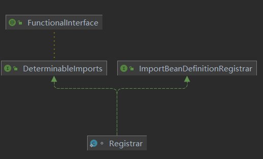
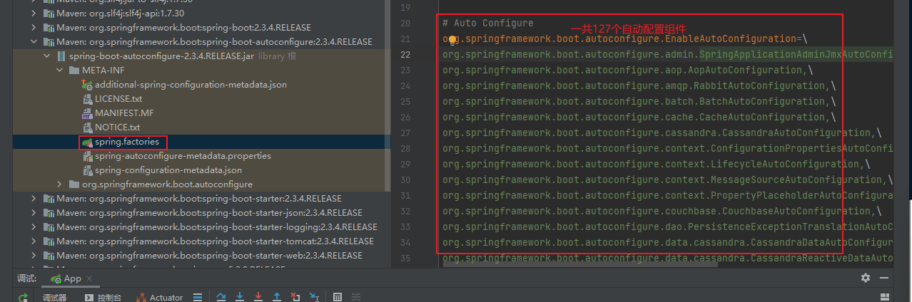
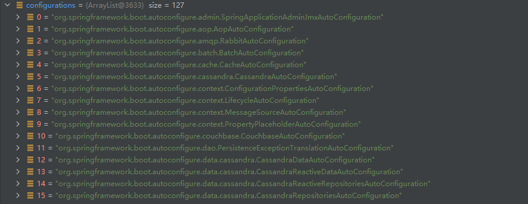

# SpringBoot2.0

## SpringBoot的优点

* 独立创建Spring应用
* 内嵌web应用
* 自动stater依赖，简化构建配置
* 自动配置Spring以及第三方功能
* 提供生产级别的监控，健康检查及外部配置
* 无代码生成，无需编写XML

## SpringBoot的缺点

* 迭代快，需要时刻关注变化
* 封装太深，内部原理复杂，不容易精通

## 微服务

* 微服务是一种架构风格
* 一个应用拆分为一组小型服务
* 每个服务运行在自己的进程内，也就是可独立部部署和升级
* 服务之间使用轻量级HTTP交互
* 服务围绕业务功能拆分
* 可以由全自动部署机制独立部署
* 去中心化，服务自治，服务可以使用不同的语言，不同的存储技术

## 入门

### maven配置

```xml
  <mirrors>
	 <mirrors>
　　　　<mirror>
　　　　　　　<id>nexus-aliyun</id>
　　　　　　　<mirrorOf>*</mirrorOf>
　　　　　　　<name>Nexus aliyun</name>
　　　　　　　<url>http://maven.aliyun.com/nexus/content/groups/public</url>
　　　　</mirror>
	</mirrors>
  </mirrors>
<profiles>
	<profile>    
		<id>jdk-1.8</id>    
		<activation>    
			<activeByDefault>true</activeByDefault>    
			<jdk>1.8</jdk>    
		</activation>    
		<properties>    
			<maven.compiler.source>1.8</maven.compiler.source>    
			<maven.compiler.target>1.8</maven.compiler.target>    
			<maven.compiler.compilerVersion>1.8</maven.compiler.compilerVersion>    
		</properties>    
	</profile>
  </profiles>
```

### 打包

```xml
<!--在pom.xml中-->
 <build>
        <plugins>
            <plugin>
                <groupId>org.springframework.boot</groupId>
                <artifactId>spring-boot-maven-plugin</artifactId>
            </plugin>
        </plugins>
    </build>
```

### 依赖管理

* 父项目依赖管理

```XML
依赖管理	
<parent>
    <groupId>org.springframework.boot</groupId>
    <artifactId>spring-boot-starter-parent</artifactId>
    <version>2.3.4.RELEASE</version>
</parent>
它的父依赖管理
<parent>
    <groupId>org.springframework.boot</groupId>
    <artifactId>spring-boot-dependencies</artifactId>
    <version>2.3.4.RELEASE</version>
</parent>

几乎声明了所有开发中常用的依赖的版本号，自动版本仲裁机制
```

* 开发导入stater场景启动器

```xml
1、见到很多spring-boot-starter-*：*就是某种场景
2、只要引入stater，这个场景的所有常规需要的依赖我我们都自动引入
3、见到的*-spring-boot-starter：第三方提供简化开发的场景启动器
4、所有场景启动器依赖最底层的依赖
<dependency>
    <groupId>org.springframework.boot</groupId>
    <artifactId>spring-boot-starter</artifactId>
    <version>2.3.4.RELEASE</version>
    <scope>compile</scope>
</dependency>
```

* 无需关注版本号，自动版本仲裁

```xml
1、引入依赖默认都是可以不写版本
2、进入非版本仲裁需要写版本号
```

* 可以修改版本号

```xml
1.在spring-boot-dependencies中查看所要的依赖版本的key
2.在pom中重写版本号。
3.添加属性<properties>所需要的依赖版本的key和版本号</properties>
```

  ## 容器功能

### 组件添加

#### @Configuration(配置)

* 编写一个类，在类上添加@Configuration注解，告诉SpringBoot这是一个配置类相当于配置文件，该类也相当于组件注册在容器中
  * 在这个类下面编写的方法上面添加@Bean注解，则会告诉SpringBoot这是一个以方法名为组件id的组件，添加到Spring容器中，返回类型就是组件的类型，返回的值就是组件在容器中的实例
    * 自动以组件名称：`@Bean("自定义的组件名称")`，当自定义名称后，无法使用方法名调用组件。
  * 在spring5.2以后多了一个属性`proxyBeanMethods默认值为true` (是不是代理bean的方法)：外部无论对配置类中的这个组件注册方法调用多少次获取的都是之前注册容器中的单实例对象：获取的本省就是代理对象，springboot总会检查这个组件是否在容器中;当修改为false后则不是单实例对象。
  * 注册完成的组件默认是单实例组件；
* Full模式
  * 配置类组件之间有依赖关系，方法会被调用得到之前单实例组件，用Full模式

* Lite模式
  * 配置类组件之间无依赖关系用Lite模式加速容器启动，减少判断


#### @Import(导入组件)

* 将类导入到组件中`@Import({类名.class,类名.class})`：该注解导入的组件名为全类名。

#### @ConditionalOnBean(条件装配注解)

* 当前组件调用另一个组件，但其另一个组件为注册到容器中，在当前组件使用该注解则会使当前组件也不会注册到容器中。`@ConditionalOnBean(name = "其他组件名")`，也可以添加到类上

#### @ImportResource(将Spring配置文件中的组件注册到容器中)

* `@ImportResource("spring配置文件名")`

#### 配置绑定@ConfigurationProperties()

* 只有在容器中的组件才能使用这个注解，而且读取的必须是主配置文件的内容，如果内容不在主配置文件中，需要添加`@propertiesSource("配置文件名")`
* 方式一：`@Compoment+@ConfigurationProperties`
* 方式二：在配置类上面使用`@EnableConfigurationProperties(组件名.class)+@ConfigurationProperties`；这种方式不适合内容不在主配置文件中
  * @EnableConfigurationProperties:
    1. 开启属性配置功能
    2. 将组件自动注入到容器中

#### 自动配置原理

* `@SpringBootApplication`相当于同时使用了`@SpringBootConfiguration、@EnableAutoConfiguration、@ComponentScan`这三个注解

* ```java
  @SpringBootConfiguration
  @EnableAutoConfiguration
  @ComponentScan(excludeFilters = { @Filter(type = FilterType.CUSTOM, classes = TypeExcludeFilter.class),
  		@Filter(type = FilterType.CUSTOM, classes = AutoConfigurationExcludeFilter.class) })
  public @interface SpringBootApplication
      
  ==========    
  
  ```

1. `@SpringBootConfiguration`

   `@Configuration`:代表当前是一个配置类

2. `@ComponentScan`:指定扫描哪些

3. `@EnableAutoConfiguration`

   ```java
   @AutoConfigurationPackage
   @Import(AutoConfigurationImportSelector.class)
   public @interface EnableAutoConfiguration
   ```

   1. `@AutoConfigurationPackage`

      ```java
      @Import(AutoConfigurationPackages.Registrar.class)//给容器导入一个组件
      public @interface AutoConfigurationPackage{}
      
      //利用Registrar给容器中导入一系列组件
      //将指定的一个包下的所有组件导入进来，启动器所在的包
      
      ```

      

   2. `@Import(AutoConfigurationImportSelector.class)`

      ```java
      1、利用getAutoConfigurationEntry(annotationMetadata);//器中批量导入一些组件
      2、利用List<String> configurations = getCandidateConfigurations(annotationMetadata, attributes);//取所有需要到导入到容器中的配置类
      3、利用工程加载，Map<String, List<String>> loadSpringFactories(@Nullable ClassLoader classLoader)；获取所有的组件
      4、从META-INF/spring.factories位置加载文件。
          默认扫描我们当前系统里面所有META-INF/spring.factories位置的文件
          spring-boot-autoconfigure-2.3.4.RELEASE.jar包里面也有META-INF/spring.factories
      ```

      ```xml
      文件里面写死了spring-boot启动时就要给容器中加载的所有配置类
      org.springframework.boot.autoconfigure.EnableAutoConfiguration=\
      org.springframework.boot.autoconfigure.admin.SpringApplicationAdminJmxAutoConfiguration,\
      org.springframework.boot.autoconfigure.aop.AopAutoConfiguration,\
      org.springframework.boot.autoconfigure.amqp.RabbitAutoConfiguration,\
      org.springframework.boot.autoconfigure.batch.BatchAutoConfiguration,\
      org.springframework.boot.autoconfigure.cache.CacheAutoConfiguration,\
      org.springframework.boot.autoconfigure.cassandra.CassandraAutoConfiguration,\
      org.springframework.boot.autoconfigure.context.ConfigurationPropertiesAutoConfiguration,\
      org.springframework.boot.autoconfigure.context.LifecycleAutoConfiguration,\
      org.springframework.boot.autoconfigure.context.MessageSourceAutoConfiguration,\
      org.springframework.boot.autoconfigure.context.PropertyPlaceholderAutoConfiguration,\
      org.springframework.boot.autoconfigure.couchbase.CouchbaseAutoConfiguration,\
      org.springframework.boot.autoconfigure.dao.PersistenceExceptionTranslationAutoConfiguration,\
      org.springframework.boot.autoconfigure.data.cassandra.CassandraDataAutoConfiguration,\
      org.springframework.boot.autoconfigure.data.cassandra.CassandraReactiveDataAutoConfiguration,\
      org.springframework.boot.autoconfigure.data.cassandra.CassandraReactiveRepositoriesAutoConfiguration,\
      org.springframework.boot.autoconfigure.data.cassandra.CassandraRepositoriesAutoConfiguration,\
      org.springframework.boot.autoconfigure.data.couchbase.CouchbaseDataAutoConfiguration,\
      org.springframework.boot.autoconfigure.data.couchbase.CouchbaseReactiveDataAutoConfiguration,\
      org.springframework.boot.autoconfigure.data.couchbase.CouchbaseReactiveRepositoriesAutoConfiguration,\
      org.springframework.boot.autoconfigure.data.couchbase.CouchbaseRepositoriesAutoConfiguration,\
      org.springframework.boot.autoconfigure.data.elasticsearch.ElasticsearchDataAutoConfiguration,\
      org.springframework.boot.autoconfigure.data.elasticsearch.ElasticsearchRepositoriesAutoConfiguration,\
      org.springframework.boot.autoconfigure.data.elasticsearch.ReactiveElasticsearchRepositoriesAutoConfiguration,\
      org.springframework.boot.autoconfigure.data.elasticsearch.ReactiveElasticsearchRestClientAutoConfiguration,\
      org.springframework.boot.autoconfigure.data.jdbc.JdbcRepositoriesAutoConfiguration,\
      org.springframework.boot.autoconfigure.data.jpa.JpaRepositoriesAutoConfiguration,\
      org.springframework.boot.autoconfigure.data.ldap.LdapRepositoriesAutoConfiguration,\
      org.springframework.boot.autoconfigure.data.mongo.MongoDataAutoConfiguration,\
      org.springframework.boot.autoconfigure.data.mongo.MongoReactiveDataAutoConfiguration,\
      org.springframework.boot.autoconfigure.data.mongo.MongoReactiveRepositoriesAutoConfiguration,\
      org.springframework.boot.autoconfigure.data.mongo.MongoRepositoriesAutoConfiguration,\
      org.springframework.boot.autoconfigure.data.neo4j.Neo4jDataAutoConfiguration,\
      org.springframework.boot.autoconfigure.data.neo4j.Neo4jRepositoriesAutoConfiguration,\
      org.springframework.boot.autoconfigure.data.solr.SolrRepositoriesAutoConfiguration,\
      org.springframework.boot.autoconfigure.data.r2dbc.R2dbcDataAutoConfiguration,\
      org.springframework.boot.autoconfigure.data.r2dbc.R2dbcRepositoriesAutoConfiguration,\
      org.springframework.boot.autoconfigure.data.r2dbc.R2dbcTransactionManagerAutoConfiguration,\
      org.springframework.boot.autoconfigure.data.redis.RedisAutoConfiguration,\
      org.springframework.boot.autoconfigure.data.redis.RedisReactiveAutoConfiguration,\
      org.springframework.boot.autoconfigure.data.redis.RedisRepositoriesAutoConfiguration,\
      org.springframework.boot.autoconfigure.data.rest.RepositoryRestMvcAutoConfiguration,\
      org.springframework.boot.autoconfigure.data.web.SpringDataWebAutoConfiguration,\
      org.springframework.boot.autoconfigure.elasticsearch.ElasticsearchRestClientAutoConfiguration,\
      org.springframework.boot.autoconfigure.flyway.FlywayAutoConfiguration,\
      org.springframework.boot.autoconfigure.freemarker.FreeMarkerAutoConfiguration,\
      org.springframework.boot.autoconfigure.groovy.template.GroovyTemplateAutoConfiguration,\
      org.springframework.boot.autoconfigure.gson.GsonAutoConfiguration,\
      org.springframework.boot.autoconfigure.h2.H2ConsoleAutoConfiguration,\
      org.springframework.boot.autoconfigure.hateoas.HypermediaAutoConfiguration,\
      org.springframework.boot.autoconfigure.hazelcast.HazelcastAutoConfiguration,\
      org.springframework.boot.autoconfigure.hazelcast.HazelcastJpaDependencyAutoConfiguration,\
      org.springframework.boot.autoconfigure.http.HttpMessageConvertersAutoConfiguration,\
      org.springframework.boot.autoconfigure.http.codec.CodecsAutoConfiguration,\
      org.springframework.boot.autoconfigure.influx.InfluxDbAutoConfiguration,\
      org.springframework.boot.autoconfigure.info.ProjectInfoAutoConfiguration,\
      org.springframework.boot.autoconfigure.integration.IntegrationAutoConfiguration,\
      org.springframework.boot.autoconfigure.jackson.JacksonAutoConfiguration,\
      org.springframework.boot.autoconfigure.jdbc.DataSourceAutoConfiguration,\
      org.springframework.boot.autoconfigure.jdbc.JdbcTemplateAutoConfiguration,\
      org.springframework.boot.autoconfigure.jdbc.JndiDataSourceAutoConfiguration,\
      org.springframework.boot.autoconfigure.jdbc.XADataSourceAutoConfiguration,\
      org.springframework.boot.autoconfigure.jdbc.DataSourceTransactionManagerAutoConfiguration,\
      org.springframework.boot.autoconfigure.jms.JmsAutoConfiguration,\
      org.springframework.boot.autoconfigure.jmx.JmxAutoConfiguration,\
      org.springframework.boot.autoconfigure.jms.JndiConnectionFactoryAutoConfiguration,\
      org.springframework.boot.autoconfigure.jms.activemq.ActiveMQAutoConfiguration,\
      org.springframework.boot.autoconfigure.jms.artemis.ArtemisAutoConfiguration,\
      org.springframework.boot.autoconfigure.jersey.JerseyAutoConfiguration,\
      org.springframework.boot.autoconfigure.jooq.JooqAutoConfiguration,\
      org.springframework.boot.autoconfigure.jsonb.JsonbAutoConfiguration,\
      org.springframework.boot.autoconfigure.kafka.KafkaAutoConfiguration,\
      org.springframework.boot.autoconfigure.availability.ApplicationAvailabilityAutoConfiguration,\
      org.springframework.boot.autoconfigure.ldap.embedded.EmbeddedLdapAutoConfiguration,\
      org.springframework.boot.autoconfigure.ldap.LdapAutoConfiguration,\
      org.springframework.boot.autoconfigure.liquibase.LiquibaseAutoConfiguration,\
      org.springframework.boot.autoconfigure.mail.MailSenderAutoConfiguration,\
      org.springframework.boot.autoconfigure.mail.MailSenderValidatorAutoConfiguration,\
      org.springframework.boot.autoconfigure.mongo.embedded.EmbeddedMongoAutoConfiguration,\
      org.springframework.boot.autoconfigure.mongo.MongoAutoConfiguration,\
      org.springframework.boot.autoconfigure.mongo.MongoReactiveAutoConfiguration,\
      org.springframework.boot.autoconfigure.mustache.MustacheAutoConfiguration,\
      org.springframework.boot.autoconfigure.orm.jpa.HibernateJpaAutoConfiguration,\
      org.springframework.boot.autoconfigure.quartz.QuartzAutoConfiguration,\
      org.springframework.boot.autoconfigure.r2dbc.R2dbcAutoConfiguration,\
      org.springframework.boot.autoconfigure.rsocket.RSocketMessagingAutoConfiguration,\
      org.springframework.boot.autoconfigure.rsocket.RSocketRequesterAutoConfiguration,\
      org.springframework.boot.autoconfigure.rsocket.RSocketServerAutoConfiguration,\
      org.springframework.boot.autoconfigure.rsocket.RSocketStrategiesAutoConfiguration,\
      org.springframework.boot.autoconfigure.security.servlet.SecurityAutoConfiguration,\
      org.springframework.boot.autoconfigure.security.servlet.UserDetailsServiceAutoConfiguration,\
      org.springframework.boot.autoconfigure.security.servlet.SecurityFilterAutoConfiguration,\
      org.springframework.boot.autoconfigure.security.reactive.ReactiveSecurityAutoConfiguration,\
      org.springframework.boot.autoconfigure.security.reactive.ReactiveUserDetailsServiceAutoConfiguration,\
      org.springframework.boot.autoconfigure.security.rsocket.RSocketSecurityAutoConfiguration,\
      org.springframework.boot.autoconfigure.security.saml2.Saml2RelyingPartyAutoConfiguration,\
      org.springframework.boot.autoconfigure.sendgrid.SendGridAutoConfiguration,\
      org.springframework.boot.autoconfigure.session.SessionAutoConfiguration,\
      org.springframework.boot.autoconfigure.security.oauth2.client.servlet.OAuth2ClientAutoConfiguration,\
      org.springframework.boot.autoconfigure.security.oauth2.client.reactive.ReactiveOAuth2ClientAutoConfiguration,\
      org.springframework.boot.autoconfigure.security.oauth2.resource.servlet.OAuth2ResourceServerAutoConfiguration,\
      org.springframework.boot.autoconfigure.security.oauth2.resource.reactive.ReactiveOAuth2ResourceServerAutoConfiguration,\
      org.springframework.boot.autoconfigure.solr.SolrAutoConfiguration,\
      org.springframework.boot.autoconfigure.task.TaskExecutionAutoConfiguration,\
      org.springframework.boot.autoconfigure.task.TaskSchedulingAutoConfiguration,\
      org.springframework.boot.autoconfigure.thymeleaf.ThymeleafAutoConfiguration,\
      org.springframework.boot.autoconfigure.transaction.TransactionAutoConfiguration,\
      org.springframework.boot.autoconfigure.transaction.jta.JtaAutoConfiguration,\
      org.springframework.boot.autoconfigure.validation.ValidationAutoConfiguration,\
      org.springframework.boot.autoconfigure.web.client.RestTemplateAutoConfiguration,\
      org.springframework.boot.autoconfigure.web.embedded.EmbeddedWebServerFactoryCustomizerAutoConfiguration,\
      org.springframework.boot.autoconfigure.web.reactive.HttpHandlerAutoConfiguration,\
      org.springframework.boot.autoconfigure.web.reactive.ReactiveWebServerFactoryAutoConfiguration,\
      org.springframework.boot.autoconfigure.web.reactive.WebFluxAutoConfiguration,\
      org.springframework.boot.autoconfigure.web.reactive.error.ErrorWebFluxAutoConfiguration,\
      org.springframework.boot.autoconfigure.web.reactive.function.client.ClientHttpConnectorAutoConfiguration,\
      org.springframework.boot.autoconfigure.web.reactive.function.client.WebClientAutoConfiguration,\
      org.springframework.boot.autoconfigure.web.servlet.DispatcherServletAutoConfiguration,\
      org.springframework.boot.autoconfigure.web.servlet.ServletWebServerFactoryAutoConfiguration,\
      org.springframework.boot.autoconfigure.web.servlet.error.ErrorMvcAutoConfiguration,\
      org.springframework.boot.autoconfigure.web.servlet.HttpEncodingAutoConfiguration,\
      org.springframework.boot.autoconfigure.web.servlet.MultipartAutoConfiguration,\
      org.springframework.boot.autoconfigure.web.servlet.WebMvcAutoConfiguration,\
      org.springframework.boot.autoconfigure.websocket.reactive.WebSocketReactiveAutoConfiguration,\
      org.springframework.boot.autoconfigure.websocket.servlet.WebSocketServletAutoConfiguration,\
      org.springframework.boot.autoconfigure.websocket.servlet.WebSocketMessagingAutoConfiguration,\
      org.springframework.boot.autoconfigure.webservices.WebServicesAutoConfiguration,\
      org.springframework.boot.autoconfigure.webservices.client.WebServiceTemplateAutoConfiguration
      
      ```
   
      这127个组件默认导入到容器中
   
      
   
      
   
   3. 按需开启自动配置项
   
      ```
      虽然我们127个场景的所有自动装配启动的时候默认全部加载。xxxxAutoConfiguration
      按照条件装配规则(@Conditional)，最终会按需配置
      ```
   
      SpringBoot默认会在底层配置好所有的组件，但是如果用户自己配置了以用户的优先

### 实践

#### SpringBoot应用配置编写

* 引入场景依赖
  * https://docs.spring.io/spring-boot/docs/current/reference/html/using.html#using.build-systems.starters：官网查看x
* 查看自动配置了那些(选做)
  * 自己分析，引入场景对应的自动配置一般都生效了
  * 在配置文件中debug=true开启自动配置报告。**Negative matches:**下的都是没有生效 的/**Positive matches**:下面的都是生效的
* 是否需要修改
  * 参考文档进行修改配置项
    * https://docs.spring.io/spring-boot/docs/current/reference/html/application-properties.html#appendix.application-properties
    * 自己分析。xxxxProperties绑定了配置文件中的哪些
  * 自定义加入或替换组件
    * @Bean、@Component...
  * 自定义器 XXXXXCustomizer
  * ......

### 开发技巧

 #### 热更新插件

* dev-tools

  ```xml
  <dependency>
      <groupId>org.springframework.boot</groupId>
      <artifactId>spring-boot-devtools</artifactId>
      <optional>true</optional>
  </dependency>
  ```

​		按ctrl+F9

## 核心功能

### 配置文件

* YAML：是一种标记语言，非常适合用来做数据为中心的配置文件

* 基本语法

  * key:value；kv之间有空格
  * 大小写敏感
  * 使用缩进表示层级关系
  * 缩进不允许使用tab，只允许空格
  * 缩进的空格数不重要，只要相同层级的元素左对齐即可
  * ‘#’表示注释
  * 字符串无需加引号，如果要加。“与”表示字符串内容，会被 转义/不转义

* 数据类型

  * 字面量：单个的、不可再分的值。date、boolean、string、number、null
  * 对象：键值对的集合。map、hash、object
  * 数组：一组按次序排序的值。array、list、queue、set

* 添加配置提示依赖 

  ```xml
  <dependency>
      <groupId>org.springframework.boot</groupId>
      <artifactId>spring-boot-configuration-processor</artifactId>
      <optional>true</optional>
  </dependency>
      
      
      #将这个依赖不进行打包
  <configuration>
      <excludes>
          <exclude>
              <groupId>org.springframework.boot</groupId>
              <artifactId>spring-boot-configuration-processor</artifactId>
          </exclude>
      </excludes>
  </configuration>
  ```

  
